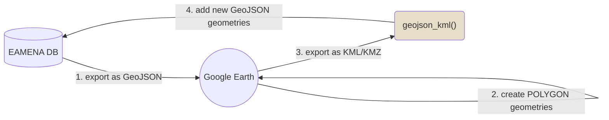

# ***eamenaR*** 
> R package for front-end statistical analysis of the EAMENA database

The ***eamenaR*** package allows to analyse the [typological](https://github.com/eamena-oxford/eamenaR#typology), [spatial](https://github.com/eamena-oxford/eamenaR#time) and [temporal](https://github.com/eamena-oxford/eamenaR#time) facets of the [EAMENA database](https://database.eamena.org/en/).  
  
The two main sources of data are: GeoJSON files exported by [EAMEANA searches](https://github.com/eamena-oxford/eamena-arches-dev/tree/main/data/geojson#readme), or via a direct connection to the EAMENA PostgreSQL database.  
  
The two main types of output are static graphs and maps, for publication on paper, and interactive graphs and maps for publication on the web.  
  
The functions names refer to their content :

| function prefix      | Description                          |
| -----------          | -----------                          |
| list_*               | structure a dataset                  |
| plot_*               | creates a map, a graphic, etc.       |
| ref_*                | creates a refence dataset            |

# Install and load package

Install the R package

```
devtools::install_github("eamena-oxford/eamenaR")
```

And load the package

```
library(eamenaR)
```

By default, the output will be saved in the `results/` folder. You can change the output folder by changing the `dirOut` option in the various functions.

# Main functions

## Prepare your data

### GeoJSON files

Create a search in EAMENA, in the export menu, copy the GeoJSON URL, paste it into your web browser and create a GeoJSON file[^1].
#### Export an EAMENA search ot a GeoJSON file

Use [EAMENA](https://database.eamena.org/) to create a GeoJSON dataset. This dataset can then be used by the [eamenaR](https://github.com/eamena-oxford/eamenaR#readme) package and the [reveal.js](https://github.com/eamena-oxford/reveal.js#readme) framework

1. **EAMENA search**  

In EAMENA, search for the resources, select Download and copy the **geojson url** (in green) to the clipboard.


2. **Get the GeoJSON content**  
  
  
Paste the copied URL into the address bar, the result is something like :


You can reformat the (Geo)JSON layout to make it more readable using https://codebeautify.org/jsonviewer
  

3. **Create a new GeoJSON file**  
  
Copy the text content and save it in a new GeoJSON file, for example **caravanserail.geojson** Heritage Places ([rendered](https://github.com/eamena-oxford/eamena-arches-dev/blob/main/data/geojson/caravanserail.geojson) | [raw](https://raw.githubusercontent.com/eamena-oxford/eamena-arches-dev/main/data/geojson/caravanserail.geojson))

#### Share a GeoJSON geometry

Go to https://geojson.io/, use the geocoder to find a location, draw a POINT, LINE or a POLYGON (in green), copy the JSON geometry (in red) and paste it into a new `.geojson` file.  


The format of a rectangle selection is 4 different points[^2], starting from the geographical origin (`xmin, ymin`), e.g.: `"POINT(0 0)"`

```
[
    xmin,
    ymin
],
[
    xmax,
    ymin
],
[
    xmax,
    ymax
],
[
    xmin
    ymax
],
[
    xmin,
    ymin
]
```

#### Integrating Google Earth geometries

Most of the geometries in EAMENA are POINTS (Center Point). The objective is to acquire new geometries created in Google Earth and to add them to already existing records in EAMENA.


$\colorbox{#e7deca}{{\color{black}{function}}}$: [geojson_kml()](https://eamena-oxford.github.io/eamenaR/doc/geojson_format_kml)  
$\colorbox{#e7deca}{{\color{black}{function}}}$: [geojson_kml()](https://eamena-oxford.github.io/eamenaR/docs/geojson_analysis)  
$\colorbox{#e7deca}{{\color{black}{function}}}$: [geojson_kml()](https://eamena-oxford.github.io/eamenaR/geojson_kml)  
$\colorbox{#e7deca}{{\color{black}{function}}}$: [geojson_kml()](https://eamena-oxford.github.io/eamenaR/doc/geojson_analysis)  

### BU mapping

Get a BU file (target file, see ["what is a BU?"](https://github.com/eamena-oxford/eamena-arches-dev/tree/main/data/bulk#bulk-upload-bu--)) from an already structured file (source file) with the `list_mapping_bu()` function. This function uses a mapping file to create the equivalences between the source file and the target file

<center>
  
any structured file (source) ➡️ ***eamenaR*** mapping function + mapping file ➡️ bulk upload file (target)
  
</center>

For example, the dataset prepared by Mohamed Kenawi (`mk`):

```
library(dplyr)

list_mapping_bu(bu.path = "C:/Rprojects/eamena-arches-dev/data/bulk/bu/",
                job = "mk",
                verb = T,
                mapping.file = 'https://docs.google.com/spreadsheets/d/1nXgz98mGOySgc0Q2zIeT1RvHGNl4WRq1Fp9m5qB8g8k/edit#gid=1083097625',
                mapping.file.ggsheet = T)
```

#### Mapping file

The mapping file could be either an XLSX file or a Google Sheet. This file establishes the correspondences between a source file and the structure of the EAMENA BU template (target). 


<p align="center">
  
  <br>
    <em>screenshot of the Google sheet mapping file: https://docs.google.com/spreadsheets/d/1nXgz98mGOySgc0Q2zIeT1RvHGNl4WRq1Fp9m5qB8g8k/edit?usp=sharing</em>
</p>

The mapping file has three columns, one for the target ('`EAMENA`'), two for the source (eg. '`mk`' and '`mk_type`'):

1. **target**:
  - '`EAMENA`': names of the fields in the EAMENA BU spreadsheet in R format (spaces replaced by dots). Empty cells correspond to expressions that are not directly linked to an EAMENA field. This column will always be the same. 
2. **source**:
  - The source depends on the different authors:
    - job: by convention, the initial of the author (e.g. '`mk`' = Mohamed Kenawi)
    - job_type: the type of action to perform on the source data (e.g. '`mk_type`'). This can be: 
      - repeat a single value for the whole BU ('value');
      - get the different values of a source field and add these different values in a BU field ('field');
      - execute an R code ('expression');
      - etc.;

The eamenaR function is `list_mapping_bu()`. Alongside with scripted parts recorded in the mapping file, `list_mapping_bu()` uses also the  `geom_within_gs()` to find the Grid square (gs) identifier of a record by comparing their geometries. By default, the Grid Square file is **grid_squares.geojson** ([rendered](https://github.com/eamena-oxford/eamenaR/blob/main/inst/extdata/grid_squares.geojson) | [raw](https://raw.githubusercontent.com/eamena-oxford/eamenaR/main/inst/extdata/grid_squares.geojson))

```
library(dplyr)

grid.id <- geom_within_gs(resource.wkt = "POINT(0.9 35.8)")
grid.id
```
Will return `"E00N35-44"`

#### Source file

The source file, or original dataset, is assumed to be an XLSX file but it is possible to work with a SHP, or any other suitable format.

#### Target file

Export a new BU worksheet. 

<p align="center">
  
  <br>
    <em>screenshot of the output BU</em>
</p>

The data from this new worksheet can be copied/pasted into a [BU template](https://github.com/eamena-oxford/eamena-arches-dev/tree/main/data/bulk/templates) to retrieve the drop down menus and 3-lines headers. Once done, the BU can be sent to EAMENA.

<p align="center">
  
  <br>
    <em>screenshot of the output BU once copied/pasted into the template</em>
</p>

### Fields

#### Grid cell ID

To recover the Grid cell ID for a given coordinates, use the `geom_bbox()` function on the BU file to retrieve the xmin, xmax, ymin, ymax (minimum bounding box) of the heritage places and creates as a **GeoJSON file**. In EAMENA DB, select `Filter` > `Map Search` >` Edit GeoJSON` and copy/paste the content of the new exported **GeoJSON file** into the EAMENA `Edit GeoJSON` field. Under the `Search` bar, filter by resources (`Resource Type`) and select `Grid Square`. Once the filters `Map Filtered Enabled` and `Grid Square` are on, only the needed Grid squares appear in the results. Export these grid squares as a `geojson url`, paste this URL into a web browser, copy the content of the output into a new GeoJSON file and save this file. This last GeoJSON file will be used in the `geom_within_gs()` function to retrieve the correct Grid square ID for each heritage place in the BU.


## Typology

Whether the data is Heritage Places, Built Components, etc.

## Spatial

Distribution maps for Heritages places and Geoarchaeology

### Heritages places

For the default GeoJSON file **caravanserail.geojson** Heritage Places ([rendered](https://github.com/eamena-oxford/eamena-arches-dev/blob/main/data/geojson/caravanserail.geojson) | [raw](https://raw.githubusercontent.com/eamena-oxford/eamena-arches-dev/main/data/geojson/caravanserail.geojson))

```
geojson_map(map.name = "caravanserail", fig.width = 11, export.plot = T)
```

<p align="center">
  
</p>

Maps can also be calculated on the values of GeoJSON fields, by adding the field names in the function options.

```
geojson_map(map.name = "caravanserail",
            field.names = c("Damage Extent Type"),
            fig.width = 11,
            export.plot = T)
```

<p align="center">
  
</p>

The color of the value (optional) is recorded in the (`symbology.xlsx`)[https://github.com/eamena-oxford/eamenaR/blob/main/inst/extdata/symbology.xlsx] file  

<p align="center">
  
  <br>
    <em>screenshot of the `symbology.xlsx` file registering the different colors of the values (only the columns `list`, `values` and `colors` are used)</em>
</p>

```
geojson_map(map.name = "caravanserail",
            field.names = c("Disturbance Cause Type ", "Damage Extent Type"),
            fig.width = 11,
            export.plot = T)
```

It will create two series of maps, one for each field (`"Disturbance Cause Type ", "Damage Extent Type"`) and because in `"Damage Extent Type"` there are multiple values for a same row, it creates as many maps as there are different values, here is an example:

<p align="center">
  
  
</p>

#### Heritages places IDs ➡️ EAMENA ID 

Retrieve the matches between these maps' IDs and the EAMENA IDs for heritage places by running:

```
geojson_stat(stat.name = "caravanserail", stat = "list_ids", export.stat = T)
```

This will give the data frame [caravanserail_list_ids.tsv](https://github.com/eamena-oxford/eamenaR/blob/main/results/caravanserail_list_ids.tsv). If you want the maps' IDs listed (e.g. for a figure caption), run :

```
geojson_stat(stat.name = "caravanserail", stat = "list_ids", export.stat = F)
```

Will give:

```
1: EAMENA-0192223, 2: EAMENA-0192598, 3: EAMENA-0192599, [...], 153: EAMENA-0194775, 154: EAMENA-0194776, 155: EAMENA-0194777, 156: EAMENA-0194778
```
#### Paths

Reading the GeoJSON file of the heritage places, and [the CSV file](https://github.com/eamena-oxford/eamenaR/blob/main/inst/extdata/caravanserail_paths.csv) registering the paths between these heritage places, identified by different routes (route 1, route 2, etc.)

```
geojson_map_path(map.name = "caravanserail_paths", export.plot = T, fig.width = 11)
```

<p align="center">
  
</p>

Path lengths can be visualized in a boxplot, by routes

```
geojson_boxplot_path(export.plot = T)
```

<p align="center">
  
</p>


#### Measurements

Plot some measurements, here the areas, both for the whole heritage places (left) or for the heritages places discrimined by routes (right):

```
require(gridExtra)
p1 <- geojson_measurements(stat.name = "areas")
p2 <- geojson_measurements(stat.name = "areas_by_routes", by.routes = T)

grid.arrange(p1, p2, ncol = 2, widths = c(1, 2))
```

<p align="center">
  
</p>


### Geoarchaeology

For MaREA geoarchaeological data:

```
geojson_map(map.name = "geoarch",
            ids = "GEOARCH.ID",
            stamen.zoom = 6,
            geojson.path = "C:/Rprojects/eamena-arches-dev/data/geojson/geoarchaeo.geojson",
            export.plot = F)
```

<p align="center">
  
</p>

## Time

Either for [cultural periods](https://github.com/eamena-oxford/eamenaR#cultural-periods) or [EDTF](https://github.com/eamena-oxford/eamenaR#edtf) formats

### Cultural Periods

#### Plot cultural period from a GeoJSON file

Create a hash dictonnary named `d` to store all data

```
library(hash)

d <- hash()
```

Store all periods and sub-periods represented in the GeoJSON in the `d` dictonnary, and plot them by EAMENA ID

```
d <- list_cultural_periods(db = "geojson", 
                           d = d)
plot_cultural_periods(d = d, field = "periods", plot.type = "by.eamenaid", export.plot = T)
plot_cultural_periods(d = d, field = "subperiods", plot.type = "by.eamenaid", export.plot = T)
```
<p align="center">
  
<br><br>
and superiods
<br><br>
  
</p>

Here, the `plot_cultural_periods()` function will export two PNG charts for the default **caravanserail.geojson** file.
Periods and subperiods represented in a GeoJSON file can also be summed in a histogram

```
plot_cultural_periods(d = d, field = "subperiods", plot.type = "histogram", export.plot = T)
```
<p align="center">
  
</p>

### EDTF

Performs an aoristic analysis. By default, the function reads the sample data `disturbances_edtf.xlsx` and performs the analysis by days (year-month-day: ``ymd``). Two graphs are created, one adding up all the threats, and the other where each category of threat is individualised.

```
library(dplyr)

plot_edtf()
```

<p align="center">
  
</p>

Aggregate the dates by months (`"ym"`) by thearts categories

```
plot_edtf(edtf_span = "ym", edtf_analyse = "category")
```

<p align="center">
  
</p>

The interactive plotly output is [edtf_plotly_category_ym_threats_types.html](https://eamena-oxford.github.io/eamenaR/results/edtf_plotly_category_ym_threats_types.html)

[^1]: JavaScript is THE interactive web language, and the most popular file types are JSON and GeoJSON (respectively JavaScript Objet Notation and GeoJavaScript Object Notation).
[^2]: there is a duplicate which comes from the need to close the polygon, so the coordinates of the origin (`xmin, ymin`) are the same as those of the last point.
