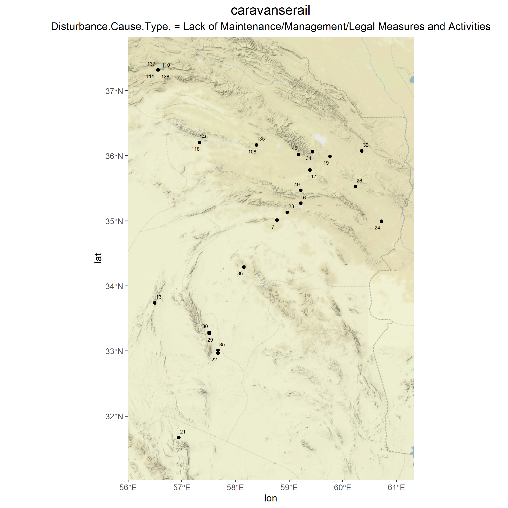
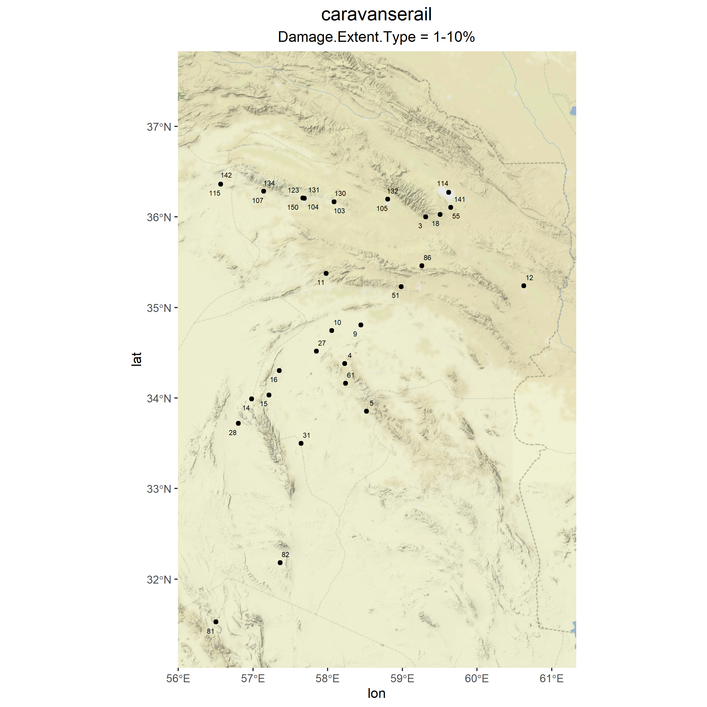
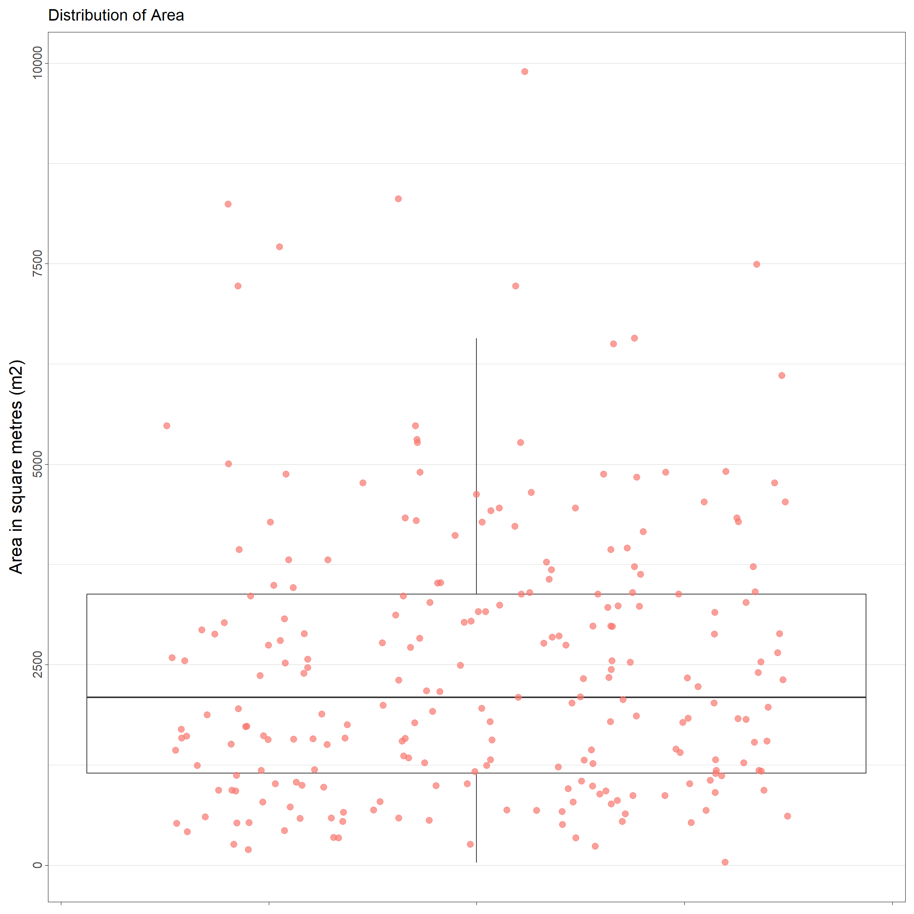

# ***eamenaR*** 
> R package for front-end statistical analysis of the EAMENA database

The ***eamenaR*** package allows to analyse the [typological](https://github.com/eamena-oxford/eamenaR#typology), [spatial](https://github.com/eamena-oxford/eamenaR#time) and [temporal](https://github.com/eamena-oxford/eamenaR#time) facets of the [EAMENA database](https://database.eamena.org/en/).  
  
The two main sources of data are: GeoJSON files exported by [EAMEANA searches](https://github.com/eamena-oxford/eamena-arches-dev/tree/main/data/geojson#readme), or via a direct connection to the EAMENA PostgreSQL database.  
  
The two main types of output are static graphs and maps, for publication on paper, and interactive graphs and maps for publication on the web.  
  
The functions names refer to their content:

| function prefix      | Description                          |
| -----------          | -----------                          |
| list_*               | structure a dataset                  |
| plot_*               | creates a map, a graphic, etc.       |
| ref_*                | creates a refence dataset            |

# Install and load package

Install the R package

```
devtools::install_github("eamena-oxford/eamenaR")
```

And load the package

```
library(eamenaR)
```

By default, the output will be saved in the `results/` folder. You can change the output folder by changing the `dirOut` option in the various functions.

# Main functions

## Prepare your data

### GeoJSON files

Create a search in EAMENA, in the export menu, copy the GeoJSON URL, paste it into your web browser and create a GeoJSON file (see this [document](https://github.com/eamena-oxford/eamena-arches-dev/tree/main/data/geojson#readme)).

### BU mapping

Get a BU file (the target file) ready to be imported into EAMENA from a source file with the `list_mapping_bu()` function, a dataset (the source file) and a mapping file

<center>
  
unstructured file ➡️ ***eamenaR*** mapping function + mapping file ➡️ bulk upload file
  
</center>

For example, the dataset prepared by Mohamed Kenawi (`mk`):

```
library(dplyr)

list_mapping_bu(bu.path = "C:/Rprojects/eamena-arches-dev/data/bulk/bu/",
                job = "mk",
                verb = T,
                mapping.file = 'https://docs.google.com/spreadsheets/d/1nXgz98mGOySgc0Q2zIeT1RvHGNl4WRq1Fp9m5qB8g8k/edit#gid=1083097625',
                mapping.file.ggsheet = T)
```

#### Mapping file

The mapping file could be either a Google Sheet:
<p align="center">
https://docs.google.com/spreadsheets/d/1nXgz98mGOySgc0Q2zIeT1RvHGNl4WRq1Fp9m5qB8g8k/edit?usp=sharing
</p>

Or an XLSX file

<p align="center">
  
  <br>
    <em>screenshot of Google sheet mapping file</em>
</p>

This file establishes the correspondences between the source file and the BU. It has three columns, one for the target (EAMENA BU template), two for the source (author's data):

1. EAMENA: names of the fields in the EAMENA BU spreadsheet in R format (spaces replaced by dots). Empty cells correspond to expressions that are not directly linked to an EAMENA field.
2. job: by convention, the initial of the author (e.g. 'mk' = Mohamed Kenawi)
3. job_type: the type of action to perform on the source data (e.g. 'mk_type'). This can be: 
  - repeat a single value for the whole BU ('value');
  - get the different values of a source field and add these different values in a BU field ('field');
  - execute an R code ('expression');
  - etc.;

The EAMENA column will always be the same, but the mapping file aims to have several authors columns. 

The eamenaR function is `list_mapping_bu()`. Alongside with scripted parts recorded in the mapping file, `list_mapping_bu()` uses also the  `geom_within_gs()` to find the Grid square (gs) identifier of a record by comparing their geometries. By default, the Grid Square file is **grid_squares.geojson** ([rendered](https://github.com/eamena-oxford/eamenaR/blob/main/inst/extdata/grid_squares.geojson) | [raw](https://raw.githubusercontent.com/eamena-oxford/eamenaR/main/inst/extdata/grid_squares.geojson))

```
library(dplyr)

grid.id <- geom_within_gs(resource.wkt = "POINT(0.9 35.8)")
grid.id
```
Will return `"E00N35-44"`

#### Source file

The source file, or original dataset, is assumed to be an XLSX file but it is possible to work with a SHP, or any other suitable format.

#### Target file

Export a new BU worksheet. 

<p align="center">
  
  <br>
    <em>screenshot of the output BU</em>
</p>

The data from this new worksheet can be copied/pasted into a [BU template](https://github.com/eamena-oxford/eamena-arches-dev/tree/main/data/bulk/templates) to retrieve the drop down menus and 3-lines headers. Once done, the BU can be sent to EAMENA.

<p align="center">
  
  <br>
    <em>screenshot of the output BU once copied/pasted into the template</em>
</p>

## Typology

Whether the data is Heritage Places, Built Components, etc.

## Spatial

Distribution maps for Heritages places and Geoarchaeology

### Heritages places

For the default GeoJSON file **caravanserail.geojson** Heritage Places ([rendered](https://github.com/eamena-oxford/eamena-arches-dev/blob/main/data/geojson/caravanserail.geojson) | [raw](https://raw.githubusercontent.com/eamena-oxford/eamena-arches-dev/main/data/geojson/caravanserail.geojson))

```
geojson_map(map.name = "caravanserail", export.plot = T)
```

<p align="center">
  
</p>

Maps can also be calculated on the values of GeoJSON fields, by adding the [field names](https://github.com/eamena-oxford/eamenaR/blob/main/results/caravanserail_list_fields.tsv) in the function options.

```
geojson_map(map.name = "caravanserail", 
            field.names = c("Disturbance.Cause.Type.", "Damage.Extent.Type"),
            export.plot = T)
```

It will create as many maps as there are different values, here is an example:

<p align="center">
  
  
</p>

Retrieve the matches between these maps' IDs and the EAMENA IDs for heritage places by running:

```
geojson_stat(stat.name = "caravanserail", stat = "list_ids", export.stat = T)
```

This will give the data frame [caravanserail_list_ids.tsv](https://github.com/eamena-oxford/eamenaR/blob/main/results/caravanserail_list_ids.tsv). If you want the maps' IDs listed (e.g. for a figure caption), run :

```
geojson_stat(stat.name = "caravanserail", stat = "list_ids", export.stat = F)
```

Will give:

```
1: EAMENA-0192223, 2: EAMENA-0192598, 3: EAMENA-0192599, [...], 153: EAMENA-0194775, 154: EAMENA-0194776, 155: EAMENA-0194777, 156: EAMENA-0194778
```

Plot the areas:

```
geojson_measurements(stat.name = "areas", plot.stat = T)
```

<p align="center">
  
</p>

### Geoarchaeology

For MaREA geoarchaeological data:

```
geojson_map(map.name = "geoarch",
            ids = "GEOARCH.ID",
            stamen.zoom = 6,
            geojson.path = "C:/Rprojects/eamena-arches-dev/data/geojson/geoarchaeo.geojson",
            export.plot = F)
```

<p align="center">
  
</p>

## Time

Either for [cultural periods](https://github.com/eamena-oxford/eamenaR#cultural-periods) or [EDTF](https://github.com/eamena-oxford/eamenaR#edtf) formats

### Cultural Periods

#### Plot cultural period from a GeoJSON file

Create a hash dictonnary named `d` to store all data

```
library(hash)

d <- hash()
```

Store all periods and sub-periods represented in the GeoJSON in the `d` dictonnary, and plot them by EAMENA ID

```
d <- list_cultural_periods(db = "geojson", 
                           d = d)
plot_cultural_periods(d = d, field = "periods", plot.type = "by.eamenaid", export.plot = T)
plot_cultural_periods(d = d, field = "subperiods", plot.type = "by.eamenaid", export.plot = T)
```
<p align="center">
  
<br><br>
and superiods
<br><br>
  
</p>

Here, the `plot_cultural_periods()` function will export two PNG charts for the default **caravanserail.geojson** file.
Periods and subperiods represented in a GeoJSON file can also be summed in a histogram

```
plot_cultural_periods(d = d, field = "subperiods", plot.type = "histogram", export.plot = T)
```
<p align="center">
  
</p>

### EDTF

Performs an aoristic analysis. By default, the function reads the sample data `disturbances_edtf.xlsx` and performs the analysis by days (year-month-day: ``ymd``). Two graphs are created, one adding up all the threats, and the other where each category of threat is individualised.

```
library(dplyr)

plot_edtf()
```

<p align="center">
  
</p>

Aggregate the dates by months (`"ym"`) by thearts categories

```
plot_edtf(edtf_span = "ym", edtf_analyse = "category")
```

<p align="center">
  
</p>

The interactive plotly output is [edtf_plotly_category_ym_threats_types.html](https://eamena-oxford.github.io/eamenaR/results/edtf_plotly_category_ym_threats_types.html)
