[](https://app.codecov.io/gh/eamena-project/eamenar?branch=main)
# ***eamenaR*** 
> R package for front-end statistical analysis of the EAMENA database

The ***eamenaR*** package allows to analyse the [typological](https://github.com/eamena-project/eamenaR#typology), [spatial](https://github.com/eamena-project/eamenaR#time) and [temporal](https://github.com/eamena-project/eamenaR#time) data, to [manage data](https://github.com/eamena-project/eamenaR#data-management), and to calculate basic statistics ([users](https://github.com/eamena-project/eamenaR#users), etc.) from the Arches-powered [EAMENA database](https://database.eamena.org/en/)[^8]. ***eamenaR*** is also open to new collaboration[^9]. 
  
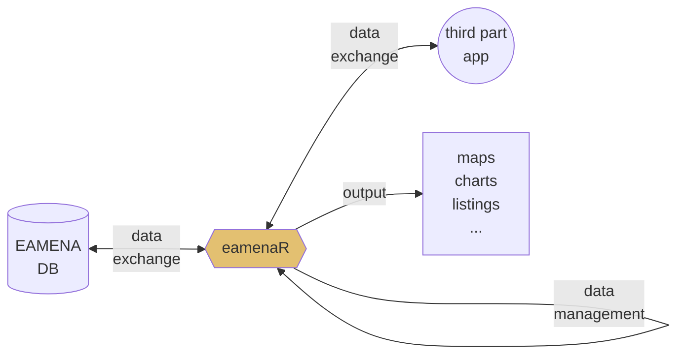
```mermaid
flowchart LR
    A[(EAMENA<br>DB)] <--data<br>exchange--> B{{"eamenaR"}}:::eamenaRpkg;
    B --data<br>management--> B;
    B <--data<br>exchange--> C((third part<br>app));
    B --"output"--> D[maps<br>charts<br>listings<br>...];
    classDef eamenaRpkg fill:#e3c071;
```

The two main sources of data are: 
* GeoJSON files exported by [EAMENA searches](https://github.com/eamena-project/eamena-arches-dev/tree/main/data/geojson#readme); 
* data exported *via* a direct connection to the EAMENA PostgreSQL database (*restricted access*); 

The two main types of output are:
* static graphs and maps, for publication on paper;
* interactive graphs and maps for publication on the web (with Plotly[^6] and Leaflet[^7]);

Together with analysis functions, the package offers different methods to manage inputs and outputs from/to EAMENA. The ***eamenaR*** package makes the EAMENA DB data FAIR (*Findable, Accessible, Interoperable, Reusable*)

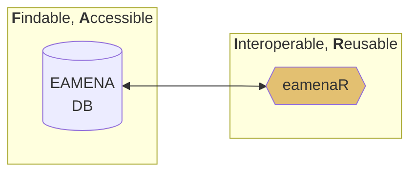
```mermaid
flowchart LR
    subgraph ide1 [<b>F</b>indable, <b>A</b>ccessible]
    A[(EAMENA<br>DB)];
    end
    A[(EAMENA<br>DB)] <---> B{{"eamenaR"}}:::eamenaRpkg;
    subgraph ide2 [<b>I</b>nteroperable, <b>R</b>eusable]
    B;
    end
    classDef eamenaRpkg fill:#e3c071;
```

## Families of functions

   
The functions names refer to their content :

| Function prefix      | Description                                            | Example                  |
| -----------          | -----------                                            |------                    |
| geojson_*            | all functions that deal with GeoJSON                   | `geojson_map()`          |
| geom_*               | any other function that deals with geometries          | `geom_bbox()`            |
| list_*               | structure a dataset                                    | `list_mapping_bu()`      |
| plot_*               | creates a map, a graphic, etc.                         | `plot_edtf()`            |
| ref_*                | direct connection to the EAMENA PostgreSQL database    | `ref_cultural_periods()` |

## Correspondances between concept labels and UUIDs

The [`ids.csv` file](https://github.com/eamena-project/eamenaR/blob/main/inst/extdata/ids.csv) is a correspondence table between permanent concepts' labels used in this package (`r.concept.name`), customised concepts' labels used in a specific Arches project `db.concept.name` and the latter UUIDs `db.concept.uuid` (by default, these values are those of the EAMENA DB). Depending on how you named your Arches instance concepts, you will have to modifiy these correspondences (see the function [`ref_ids()`](https://eamena-project.github.io/eamenaR/doc/ref_ids))

|r.concept.name            |db.concept.name           |db.concept.uuid                     |
|--------------------------|--------------------------|------------------------------------|
|id                        |EAMENA ID                 |34cfe992-c2c0-11ea-9026-02e7594ce0a0|
|Investigator.Role.Type    |Investigator Role Type    |d2e1ab96-cc05-11ea-a292-02e7594ce0a0|
|Geometric.Place.Expression|Geometric Place Expression|5348cf67-c2c5-11ea-9026-02e7594ce0a0|
|Cultural.Period           |Cultural Period           |3b5c9ac7-5615-3de6-9e2d-4cd7ef7460e4|
|Cultural.Sub-Period       |Cultural Sub-Period       |16cb160e-7b31-4872-b2ca-6305ad311011|
|Disturbance.Extent.Type   |Disturbance Extent Type   |41488800-6c00-30f2-b93f-785e38ab6251|


# Install and load package

Install the R package

```
devtools::install_github("eamena-project/eamenaR")
```

And load the package

```
library(eamenaR)
```

---

**How it works ?**  

The root directory on your local computer will be (*run*): `system.file(package = "eamenaR")`. By default, output will be saved in the `results/` folder. You can change this output folder by changing the `dirOut` option in the various functions to your choice. The `inst/extdata/` folder collects different sample files (GeoJSON, KML/KMZ, XLSX, etc.). 

---

# Data

Data will come from two sources: exported files, and SQL queries.

## Exported files

GeoJSON is the preferred format for working with EAMENA. Create a search in EAMENA, in the export menu, copy the **geojson** URL (in green) to the clipboard, paste it into your web browser and create a GeoJSON file[^1].  


Paste the copied URL into your web browser and create a GeoJSON file, the result is something like :


You can reformat the (Geo)JSON layout to make it more readable using https://codebeautify.org/jsonviewer. Copy the text content and save it in a new GeoJSON file, for example **caravanserail.geojson** ([rendered](https://github.com/eamena-project/eamena-arches-dev/blob/main/data/geojson/caravanserail.geojson) | [raw](https://raw.githubusercontent.com/eamena-project/eamena-arches-dev/main/data/geojson/caravanserail.geojson)).

## SQL queries

The PostgreSQL database is queried directly with SQL command passed through a DBI connection (`RPostgres::Postgres` driver).
# Typology

Whether the data is Heritage Places, Built Components, etc.

# Basic statistics

## Pie charts

The [`geojson_stat()`](https://eamena-project.github.io/eamenaR/doc/geojson_stat) function allows to display basic statistics. For example, a pie chart on 'Overall Condition Assessment':

```
geojson_stat(stat.name = "overall_cond",
             stat = "stats",
             field.names = c("Overall Condition State Type"),
             write.stat = T)
```
<p align="center">
  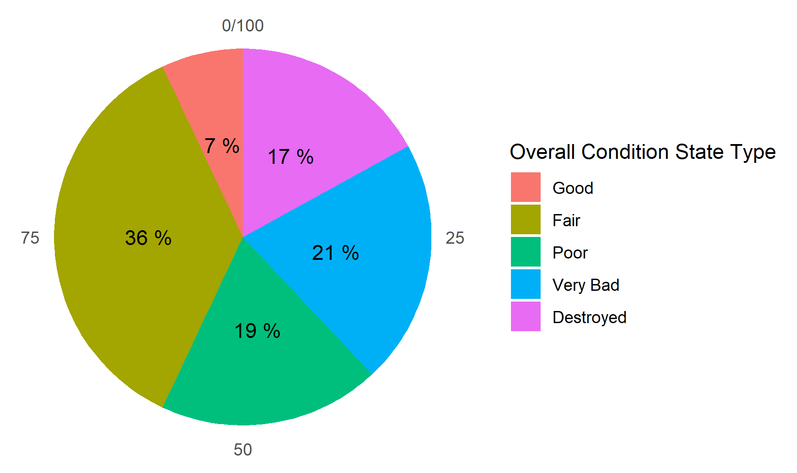
</p>

## Histograms

or an histogram on 'Disturbance Cause Type'

```
geojson_stat(stat.name = "distrub",
            stat = "stats",
            chart.type = "hist",
            field.names = c("Disturbance Cause Type"),
            fig.width = 10,
            fig.height = 9,
            write.stat = T)
```

<p align="center">
  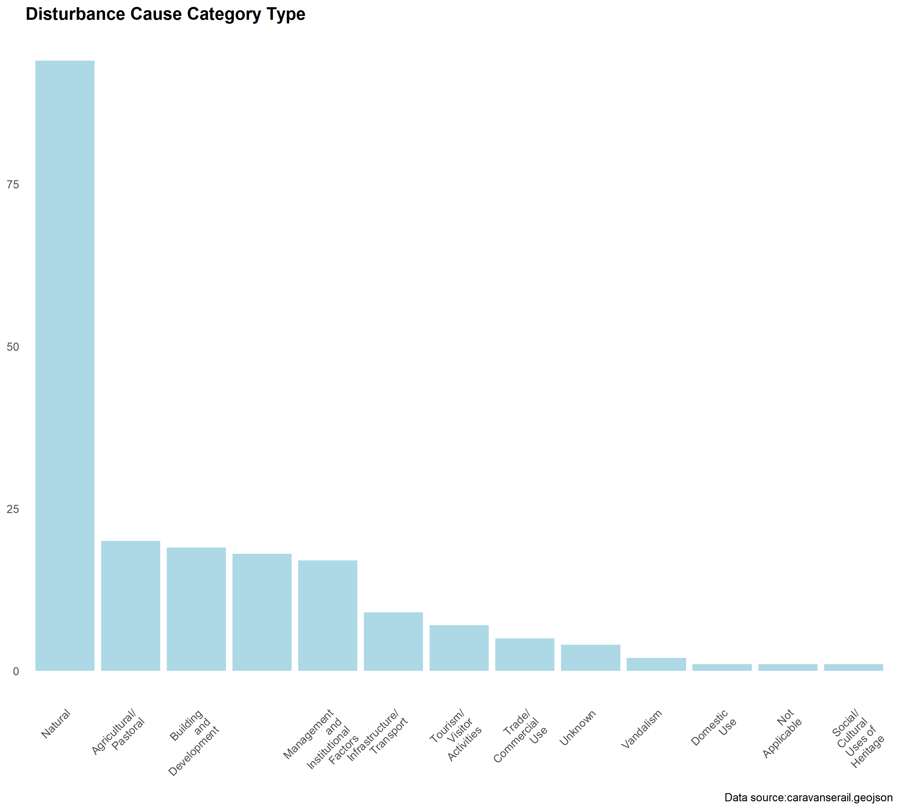
</p>

## Radar chart

or a radar chart on 'Resource Orientation'

```
geojson_stat(stat.name = "orientations",
             stat = "stats",
             chart.type = "radar",
             field.names = c("Resource Orientation"),
             fig.width = 9,
             fig.height = 8,
             write.stat = T)
```

<p align="center">
  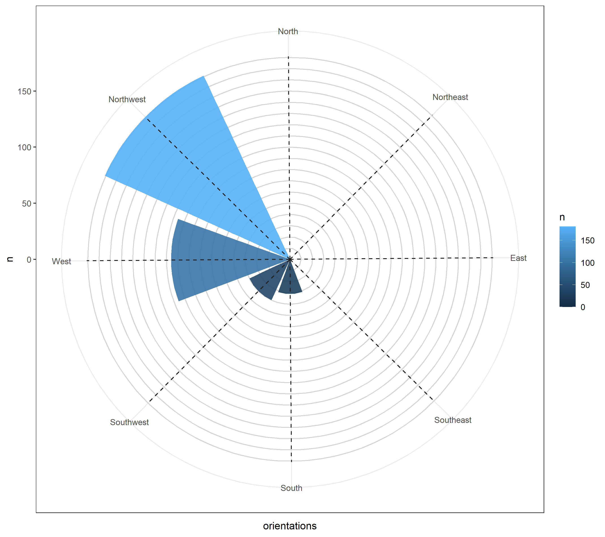
</p>

## Boxplots

The [`geojson_boxplot()`](https://eamena-project.github.io/eamenaR/doc/geojson_boxplot) function creates boxplots. Path lengths, or areas, can be visualized in a boxplot, stratified by a variable (like "route") or not. With areas (`stat = area`, by default), each dot represents an heritage place. With path lenghts (`stat = dist`), each dot represent a segment length between two neighbouring caravanserails.

```
geojson_boxplot(stat = "area")
geojson_boxplot(stat = "dist")
```

<p align="center">
  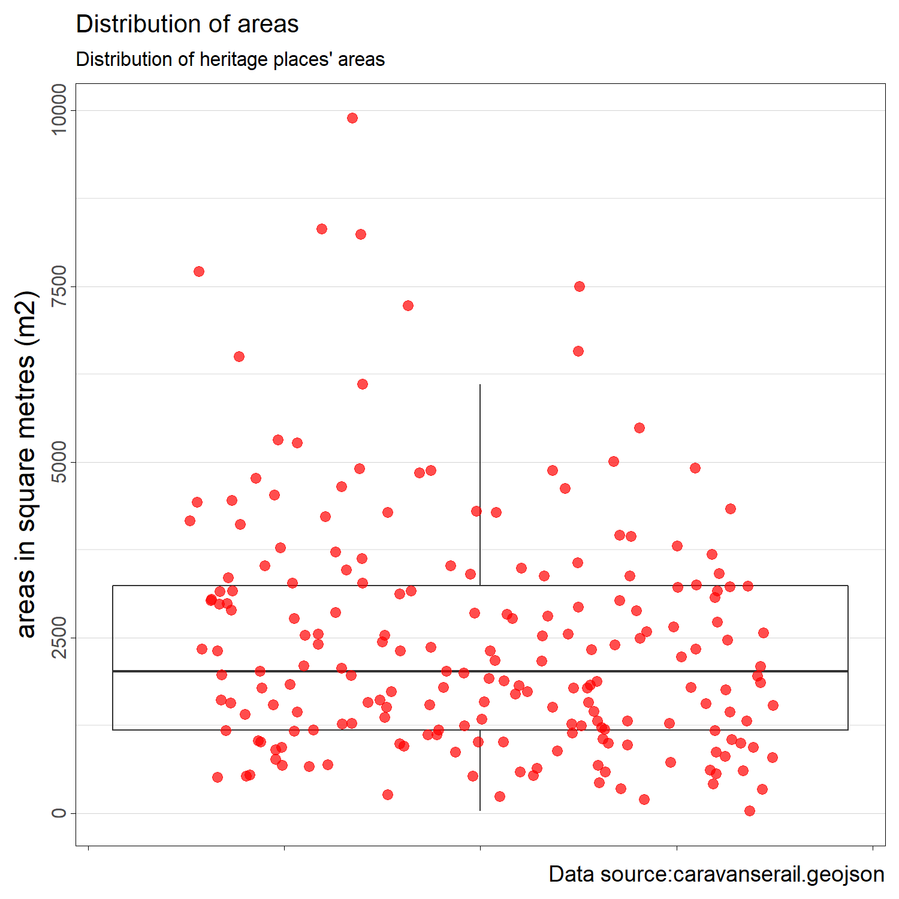
  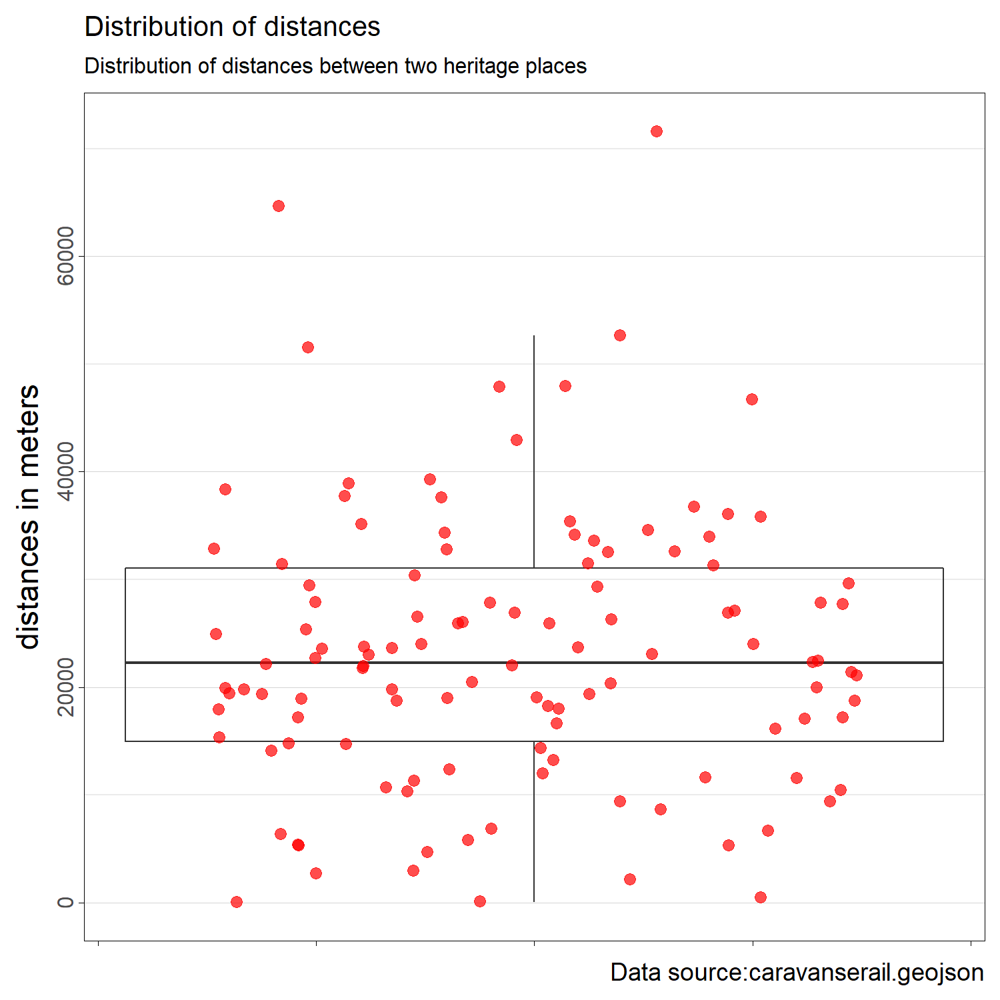
</p>

Startified by routes and exported:

```
geojson_boxplot(stat = "area", by = "route", export.plot = T)
geojson_boxplot(stat = "dist", by = "route", export.plot = T)
```
<p align="center">
  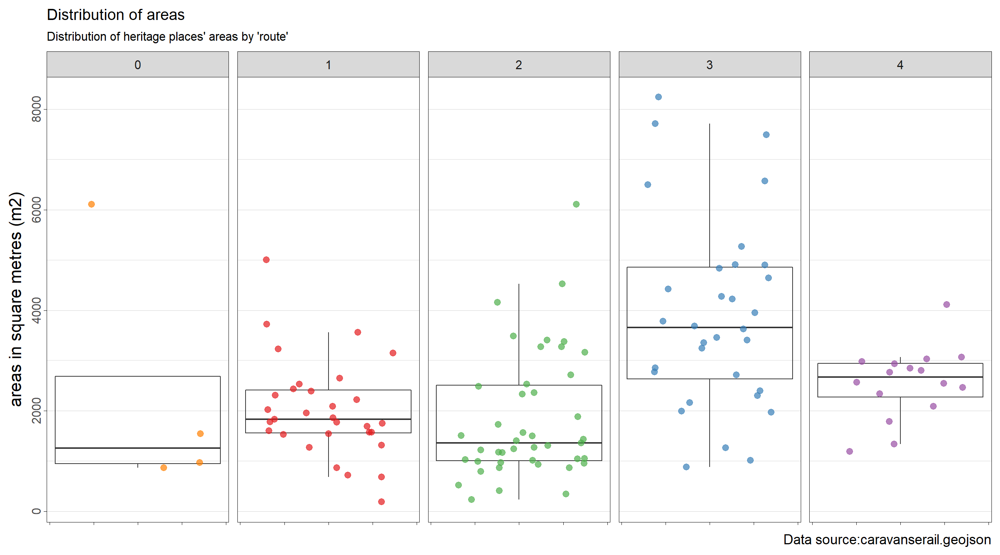
  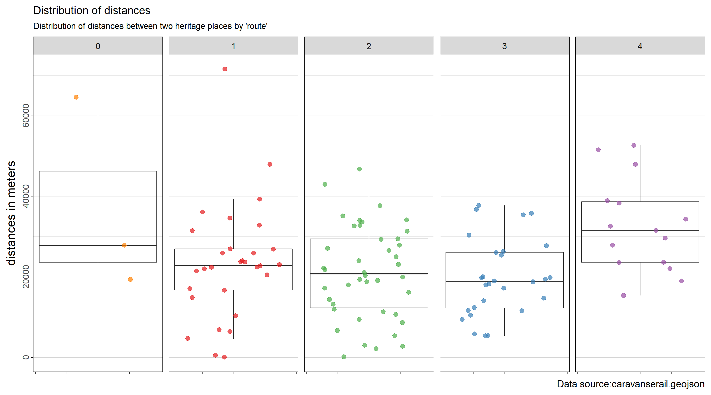
</p>

In the same way, these boxplot can be made interactive using Plotly, and exported as HTML files

```
geojson_boxplot(stat.name = "caravanserais_areas", stat = "area", by = "route",
                interactive = T,
                export.plot = T)
geojson_boxplot(stat.name = "caravanserais_dist", stat = "dist", by = "route",
                interactive = T,
                export.plot = T)
```

See these HTML files, [areas](https://eamena-project.github.io/eamenaR/results/caravanserais_areas) and [distances](https://eamena-project.github.io/eamenaR/results/caravanserais_dist)

# Spatial

Distribution maps for Heritages places and Geoarchaeology.

---

The [`ref_hps()`](https://eamena-project.github.io/eamenaR/doc/ref_hps) function allows a back-end connection.

## Heritages places

Using the default **caravanserail.geojson** ([rendered](https://github.com/eamena-project/eamena-arches-dev/blob/main/data/geojson/caravanserail.geojson) | [raw](https://raw.githubusercontent.com/eamena-project/eamena-arches-dev/main/data/geojson/caravanserail.geojson)) Heritage Places GeoJSON file

```
geojson_map(map.name = "caravanserail", fig.width = 11, export.plot = T)
```

<p align="center">
  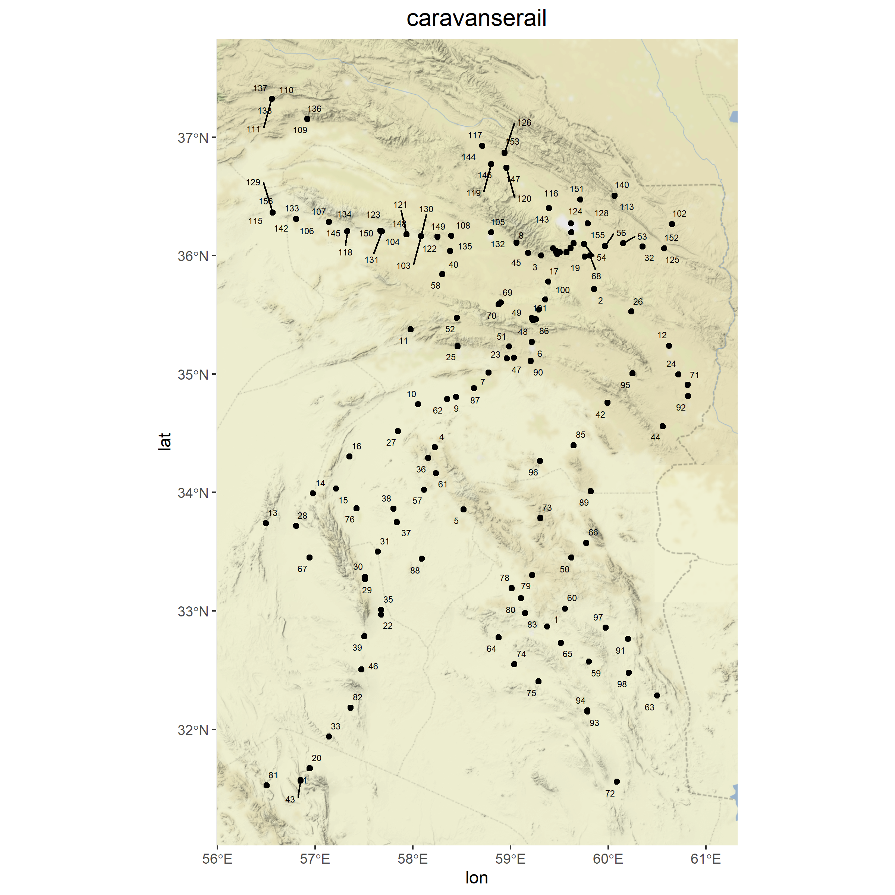
</p>

Maps can also be calculated on the values of GeoJSON fields, by adding the field names in the [`geojson_map()`](https://eamena-project.github.io/eamenaR/doc/geojson_map) function options.

```
geojson_map(map.name = "caravanserail",
            field.names = c("Damage Extent Type"),
            fig.width = 11,
            export.plot = T)
```

<p align="center">
  
</p>

The color of the value (optional) is recorded in the [`symbology.xlsx`](https://github.com/eamena-project/eamenaR/blob/main/inst/extdata/symbology.xlsx) file  

<p align="center">
  
  <br>
    <em>screenshot of the `symbology.xlsx` file registering the different colors of the values (only the columns `list`, `values` and `colors` are used)</em>
</p>

```
geojson_map(map.name = "caravanserail",
            field.names = c("Disturbance Cause Type ", "Damage Extent Type"),
            fig.width = 11,
            export.plot = T)
```

It will create two series of maps, one for each field (`"Disturbance Cause Type "`, `"Damage Extent Type"`) and because in `"Damage Extent Type"` there are multiple values for a same row, it creates as many maps as there are different values, here is an example:

<p align="center">
  
  
</p>

Finally, Plotly can be used to create an interactive map:

```
geojson_map(map.name = "caravanserail",
            geojson.path = paste0(exdata, "caravanserail_polygon.geojson"),
            plotly.plot = T,
            export.plot = F)
```

Will plot [this map](https://eamena-project.github.io/eamena-arches-dev/data/geojson/maps/caravanserail)

### Heritages places IDs ➡️ EAMENA ID 

Retrieve the matches between these maps' IDs and the EAMENA IDs for heritage places by running the [`geojson_stat()`](https://eamena-project.github.io/eamenaR/doc/geojson_stat) function:

```
geojson_stat(stat.name = "caravanserail", stat = "list_ids", export.stat = T)
```

This will give the data frame [caravanserail_list_ids.tsv](https://github.com/eamena-project/eamenaR/blob/main/results/caravanserail_list_ids.tsv). If you want the maps' IDs listed (e.g. for a figure caption), run :

```
geojson_stat(stat.name = "caravanserail", stat = "list_ids", export.stat = F)
```

Will give:

```
1: EAMENA-0192223, 2: EAMENA-0192598, 3: EAMENA-0192599, [...], 153: EAMENA-0194775, 154: EAMENA-0194776, 155: EAMENA-0194777, 156: EAMENA-0194778
```
### Paths

Reading the GeoJSON file of the heritage places, and [the CSV file](https://github.com/eamena-project/eamenaR/blob/main/inst/extdata/caravanserail_paths.csv) registering the paths between these heritage places, identified by different routes (route 1, route 2, etc.). Map them using the [`geojson_map_path()`](https://eamena-project.github.io/eamenaR/doc/geojson_map_path) function

```
geojson_map_path(map.name = "caravanserail_paths", export.plot = T, fig.width = 11)
```

<p align="center">
  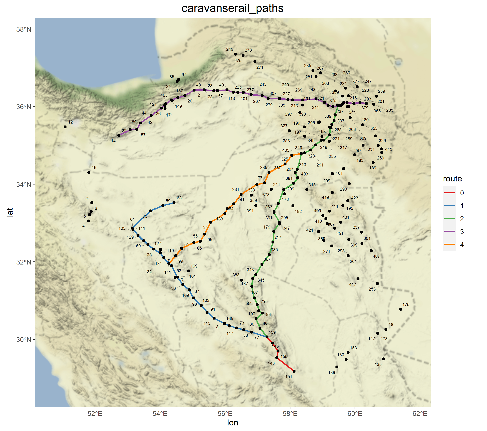
</p>

#### Interactive

A good way to control the paths, avoiding double edges, etc. is to run an interactive plot of these paths:

```
geojson_map_path(interactive = T,
                 export.plot = F)
```
Will plot these five routes (from `0` to `4`) into an interactive [VisNetwork](https://datastorm-open.github.io/visNetwork/) HTML widget, for example [route 1](https://eamena-project.github.io/eamenaR/results/paths_map_route_1)

<p align="center">
  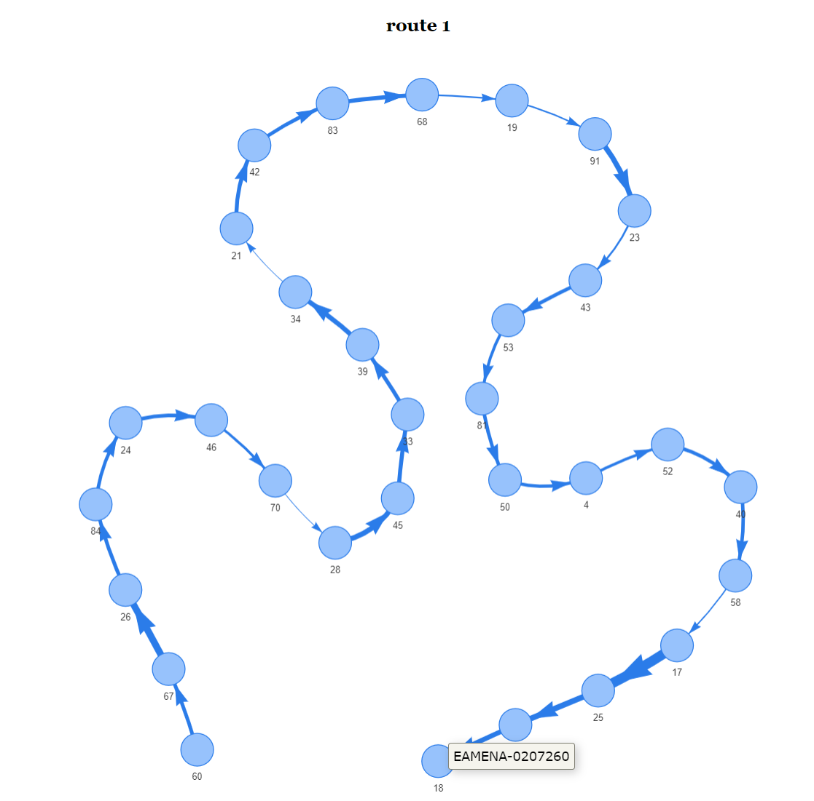
</p>

#### Profiles

Heritages places can be drawn with their elevation, for each route, using two functions: [`geojson_addZ()`](https://eamena-project.github.io/eamenaR/doc/geojson_addZ) to add a their Z value using a geoserver API and the function [`geojson_map_path()`](https://eamena-project.github.io/eamenaR/doc/geojson_map_path) to create the routes profiles (`export.type = "profile"`)

```
df <- geojson_addZ()
geojson_map_path(geojson.path = "C:/Rprojects/eamenaR/inst/extdata/caravanserailZ.geojson",
                 export.type = "profile",
                 export.plot = T,
                 fig.height = 11,
                 fig.width = 18)
```

<p align="center">
  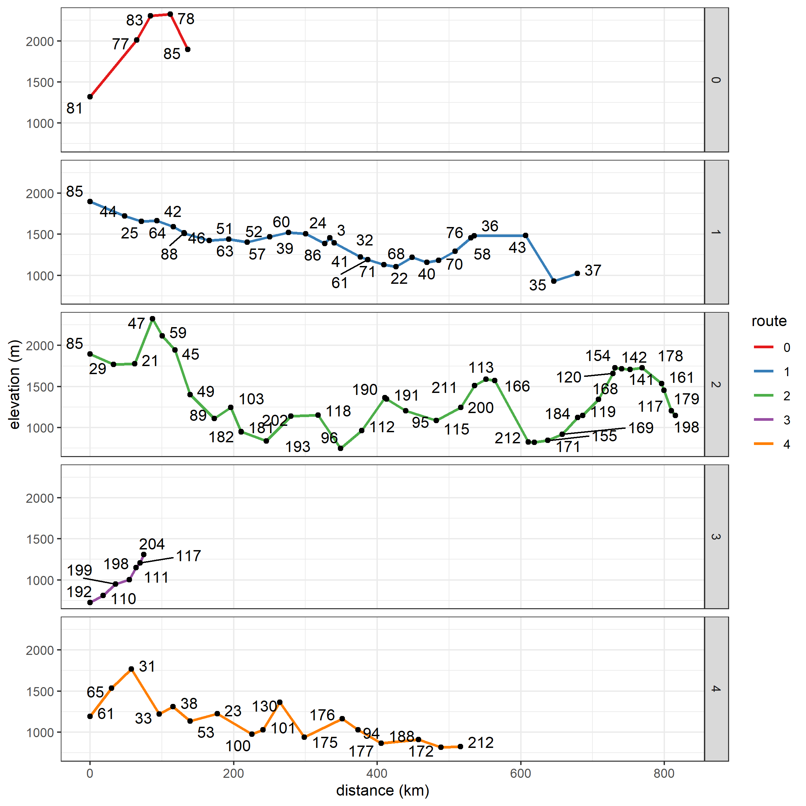
</p>

The numbers of the HP are the same as the [previous map](https://github.com/eamena-project/eamenaR#heritages-places-ids-%EF%B8%8F-eamena-id)

### Shape analysis

The use of POLYGONES (or even LINES), such as [caravanserail_polygon.geojson](https://github.com/eamena-project/eamenaR/blob/main/inst/extdata/caravanserail_polygon.geojson) allows to compute shape analysis. For the latter, we use the Momocs functions integrated in the [iconr](https://github.com/zoometh/iconr) package.
```
library(Momocs)
library(iconr)

dataDir <- "C:/Rprojects/eamena-arches-dev/projects/caravanserail"
nodes <- conv_geojson_to_wkt(dataDir = dataDir)
conv_wkt_to_jpg(nodes = nodes,
                ids = "site",
                dataDir = dataDir,
                out.dir = "_out")
```

`conv_geojson_to_wkt()` and `conv_wkt_to_jpg()` convert from GeoJSON to JPG, passing through WKT, creating this kind of outputs:

<p align="center">
  
  
  
  
  
  
</p>

These JPGs are analysed through shape analysis comparisons (here, we limit the study to 50 caravanserails)

```
dist <- morph_nds_compar(nodes = nodes,
                         cex = .5,
                         lwd = .5,
                         colored = FALSE,
                         dataDir = dataDir,
                         out.dir = "_out")
```

The variable `dist` stores the distance matrix between each pairs of caravanserails. The `morph_nds_compar()` output plots are :

<p align="center">
  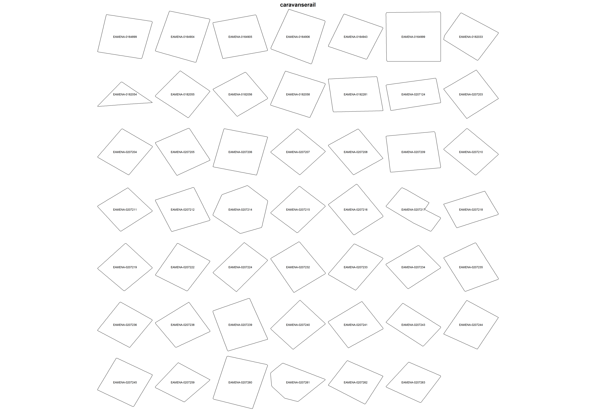
  <br>panel
</p>
<p align="center">
  
  <br>stack
</p>
<p align="center">
  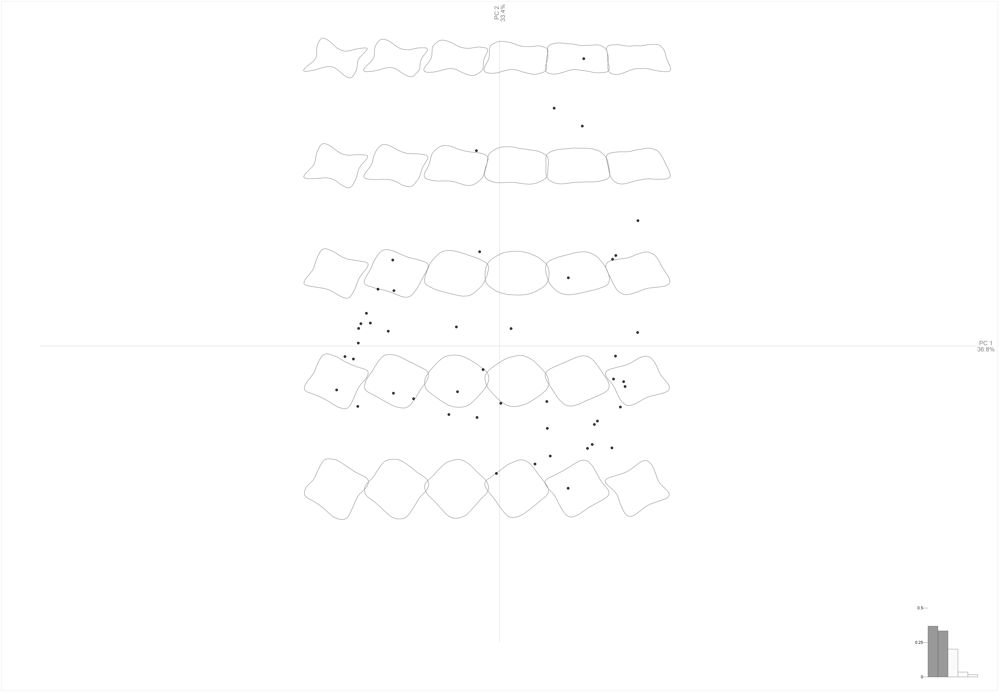
  <br>PCA
</p>
<p align="center">
  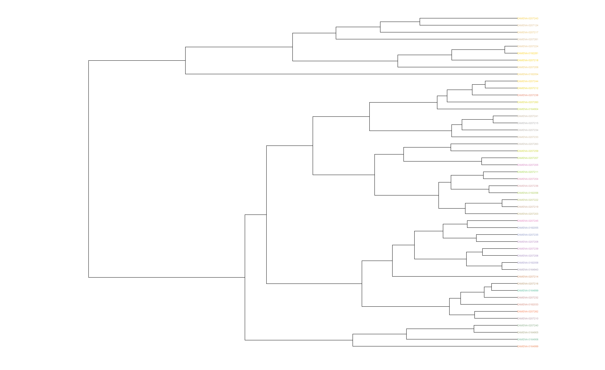
  <br>HCA
</p>


After the shape comparisons, a classification can be made with `morph_nds_group()`. The HCA shows that there are two main groups (or centres, `nb.centers = 2`). We can reuse this parameter for shape classification:

```
mbrshp <- morph_nds_group(nodes = nodes,
                          nb.centers = 2,
                          dataDir = dataDir,
                          out.dir = "_out")
```
It gives a Kmeans plot with 2 centers:

<p align="center">
  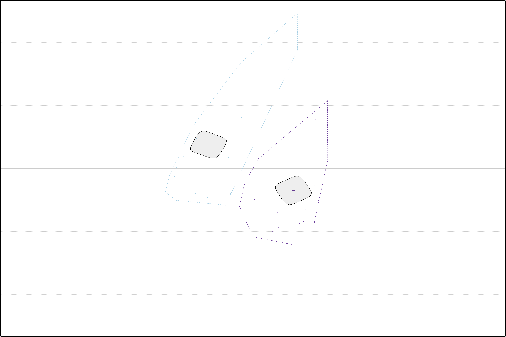
  <br>Kmeans with 2 centers
</p>

The variable `mbrshp` stores the membership of all caravanserais (here group 1 or group 2). It can be reused in the [`geojson_map()`](https://eamena-project.github.io/eamenaR/doc/geojson_map) function, for example, to locate the different forms of caravanserai.

## Related resources

Part of the information of the Heritage Places can be recorded in the Built Components (`COMPONENT-`), which are connected components of Heritage Places. For example, `COMPONENT-0000141`, `COMPONENT-0000143` and `COMPONENT-0000144` record respectively 30 Stables, 1 Courtyard and 28 Rooms for the caravanserail Maranjab (`EAMENA-164943`).

<p align="center">
  
</p>

By default, in EAMENA, relationships between Heritage Places and Built Component are of the type `PX_is_related_to`, unlike relationships between Heritage Places and Persons (`L33_has_maker`) or between Heritage Places and Grid Squares (`P89_falls_within`).  

Functions [`list_related_resources()`](https://eamena-project.github.io/eamenaR/doc/list_related_resources) allows to retrieve this data for a given Heritage Place

```
d <- hash::hash()
my_con <- RPostgres::dbConnect(drv = RPostgres::Postgres(),
                               user = 'xxx',
                               password = 'xxx',
                               dbname = 'eamena',
                               host = 'ec2-54-155-109-226.eu-west-1.compute.amazonaws.com',
                               port = 5432)

df <- list_related_resources(db.con = my_con,
                             d = d,
                             relationshiptype = "PX_is_related_to",
                             id = "EAMENA-0164943",
                             disconn = FALSE)
df
```

Will give this `df` dataframe, with the keys (`id` and `uuid`) of the connected components:

|          hp.id|                              hp.uuid|             cc.id|                              cc.uuid|
|---------------|-------------------------------------|------------------|-------------------------------------|
| EAMENA-0164943| d4feb830-10c7-4d80-a19e-e608f424be4c| COMPONENT-0000141| 90400bb6-ff54-4afd-8183-65c67fa97448|
| EAMENA-0164943| d4feb830-10c7-4d80-a19e-e608f424be4c| COMPONENT-0000143| 0dab164a-6d3a-443c-954a-50d93efbff35|
| EAMENA-0164943| d4feb830-10c7-4d80-a19e-e608f424be4c| COMPONENT-0000144| 28af281c-e4b9-44ac-aa98-2608581b7540|

Where `hp` is the Heritage place, and `cc` the connected component(s). The function [`select_related_resources()`](https://eamena-project.github.io/eamenaR/doc/select_related_resources) allows to retrieve the values of a given variable. For example, to retrieve the total number of Rooms, use the calculated dataframe `df` listing the keys (see [`list_related_resources()`](https://eamena-project.github.io/eamenaR/doc/list_related_resources)) and modify the parameter `having`. By default the value will be read in the field `"Measurement Number"` (function parameter `measure`).

```
df.measures <- select_related_resources(db.con = my_con,
                                        having = "Room",
                                        df = df)
df.measures
```

Will give this `df.measures` dataframe:

|hp.id          |hp.uuid                              |cc.id             |cc.uuid                              |cc.type | cc.measure|
|:--------------|:------------------------------------|:-----------------|:------------------------------------|:-------|----------:|
|EAMENA-0164943 |d4feb830-10c7-4d80-a19e-e608f424be4c |COMPONENT-0000144 |28af281c-e4b9-44ac-aa98-2608581b7540 |Room    |         28|

To retrieve the Heritage places' information about Rooms and Stables, create a dataframe to store this data, and run a loop stament over Heritage Places and types of Built components:

```
hps <- c("EAMENA-0164943", "EAMENA-0164937", "EAMENA-0164905")
bcs <- c("Room", "Stable")

df.measures.all <- data.frame(hp.id = character(),
                              hp.uuid = character(),
                              cc.id = character(),
                              cc.uuid = character(),
                              cc.type = character(),
                              cc.measure = numeric())

for(ea in hps){
  df <- list_related_resources(db.con = my_con,
                               d = d,
                               id = ea,
                               disconn = F)
  for(have in bcs){
    df.measures <- select_related_resources(db.con = my_con,
                                            df = df,
                                            having = have,
                                            disconn = F)
    df.measures.all <- rbind(df.measures.all, df.measures)
  }
}
df.measures.all[ , c("hp.id", "cc.id", "cc.type", "cc.measure")]
```

Will give:

|hp.id          |cc.id             |cc.type | cc.measure|
|:--------------|:-----------------|:-------|----------:|
|EAMENA-0164943 |COMPONENT-0000144 |Room    |         28|
|EAMENA-0164943 |COMPONENT-0000141 |Stable  |         30|
|EAMENA-0164937 |COMPONENT-0000148 |Room    |         37|
|EAMENA-0164937 |COMPONENT-0000149 |Stable  |         60|
|EAMENA-0164905 |COMPONENT-0000145 |Room    |         24|
|EAMENA-0164905 |COMPONENT-0000146 |Stable  |         30|


## Geoarchaeology

For MaREA geoarchaeological data, with the [`geojson_map()`](https://eamena-project.github.io/eamenaR/doc/geojson_map) function:

```
geojson_map(map.name = "geoarch",
            ids = "GEOARCH.ID",
            stamen.zoom = 6,
            geojson.path = "C:/Rprojects/eamena-arches-dev/data/geojson/geoarchaeo.geojson",
            export.plot = F)
```

<p align="center">
  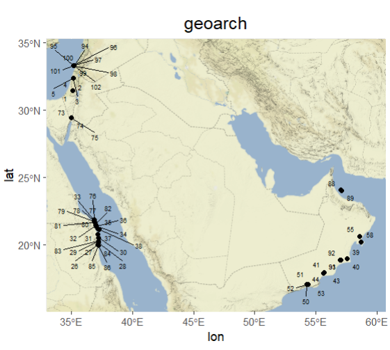
</p>

# Time

Either for [cultural periods](https://github.com/eamena-project/eamenaR#cultural-periods) or [EDTF](https://github.com/eamena-project/eamenaR#edtf) formats

## Cultural Periods

### Cultural and Subcultural periods references

Use the [`ref_cultural_periods()`](https://eamena-project.github.io/eamenaR/doc/ref_cultural_periods) and [`list_child_concepts()`](https://eamena-project.github.io/eamenaR/doc/list_child_concepts) to retrieve the list of cultural periods and subperiods directly from the EAMENA DB. 

```
# create an hash dictionnary to store the cultural ans subcultural periods
d <- hash::hash()
# replace 'xxx' with the username and password
my_con <- RPostgres::dbConnect(drv = RPostgres::Postgres(),
                               user = 'postgres',
                               password = 'postgis',
                               dbname = 'eamena',
                               host = 'ec2-54-155-109-226.eu-west-1.compute.amazonaws.com',
                               port = 5432)
# get cultural periods and subcultural periods
d <- list_child_concepts(db.con = my_con, d = d, 
                         field = "cultural_periods", 
                         concept.name = 'Cultural Period',
                         disconn = F)
d <- ref_cultural_periods(db.con = my_con, d = d,
                          field = "cultural_periods",
                          disconn = F)
d <- list_child_concepts(db.con = my_con, d = d, 
                         field = "cultural_subperiods", 
                         concept.name = 'Cultural Sub-Period',
                         disconn = F)
d <- ref_cultural_periods(db.con = my_con, d = d,
                          field = "cultural_subperiods")
# export as TSV
df.periods <- rbind(d$cultural_periods, d$cultural_subperiods)
tout <- paste0("C:/Rprojects/eamena-arches-dev/projects/periodo/cultural_periods.tsv")
write.table(df.periods, tout, sep ="\t", row.names = F)
```

Gives [this TSV dataframe](https://github.com/eamena-project/eamenaR/blob/main/results/cultural_periods.tsv) with (sub)cultural periods names, *tpq* and *taq*

<p align="center">
  
    <br>
  <em>screenshot of the</em> `cultural_periods.tsv` <em>dataframe</em>
</p>

---
  
**How it works ?**

These two functions connects the EAMENA DB to parse the arborescence of periods (parents) and superiods (childs) concepts (a tree-like structure) to retrieve their names, their start date (*tpq*) and end date (*taq*).

<p align="center">
  
  <br>
  <em>screenshot of the Reference Data Manager, parent node Cultural Period</em>
</p>

These latters (start date and end date) are stored in the `scopeNote` of each cultural periods and subperiods

<p align="center">
  
  <br>
  <em>screenshot of the Reference Data Manager, child node Palaeolithic (Levant/Mesopotamia/Arabia)</em>
</p>
  
---

### Plot cultural periods from a GeoJSON file

Create a hash dictonnary named `d` to store all data

```
library(hash)

d <- hash()
```

Store all periods and sub-periods represented in the GeoJSON in the `d` dictonnary, and plot them by EAMENA ID using the [`list_cultural_periods()`](https://eamena-project.github.io/eamenaR/doc/list_cultural_periods) function

```
d <- list_cultural_periods(db = "geojson", 
                           d = d)
plot_cultural_periods(d = d, field = "periods", plot.type = "by.eamenaid", export.plot = T)
plot_cultural_periods(d = d, field = "subperiods", plot.type = "by.eamenaid", export.plot = T)
```
<p align="center">
  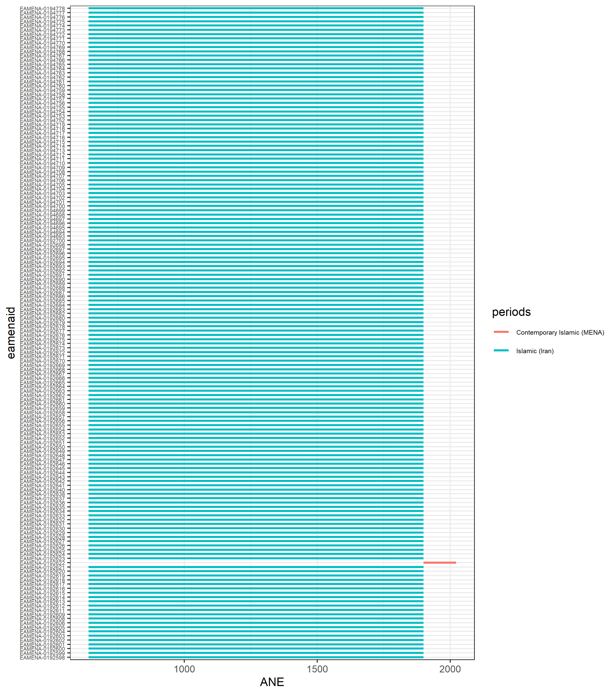
<br><br>
and superiods
<br><br>
  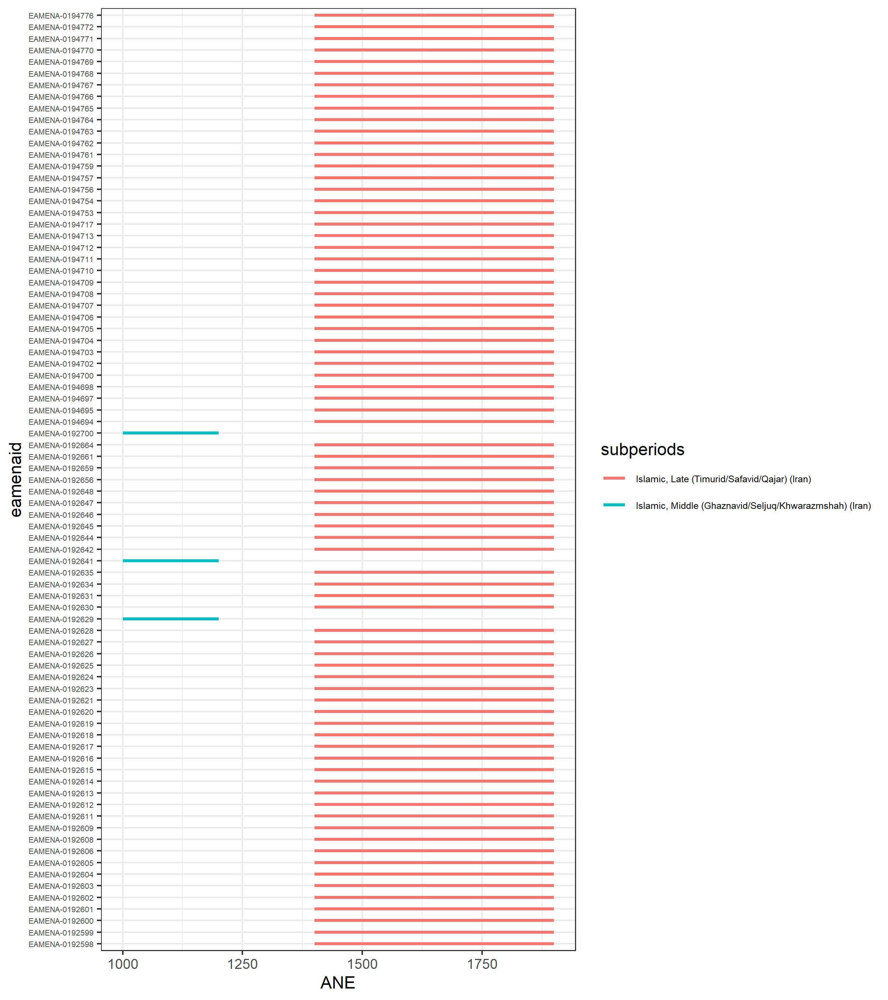
</p>

Here, the [`plot_cultural_periods()`](https://eamena-project.github.io/eamenaR/doc/plot_cultural_periods) function  will export two PNG charts for the default **caravanserail.geojson** ([rendered](https://github.com/eamena-project/eamena-arches-dev/blob/main/data/geojson/caravanserail.geojson) | [raw](https://raw.githubusercontent.com/eamena-project/eamena-arches-dev/main/data/geojson/caravanserail.geojson)) file. Periods and subperiods represented in a GeoJSON file can also be summed in a histogram

```
plot_cultural_periods(d = d, field = "subperiods", plot.type = "histogram", export.plot = T)
```
<p align="center">
  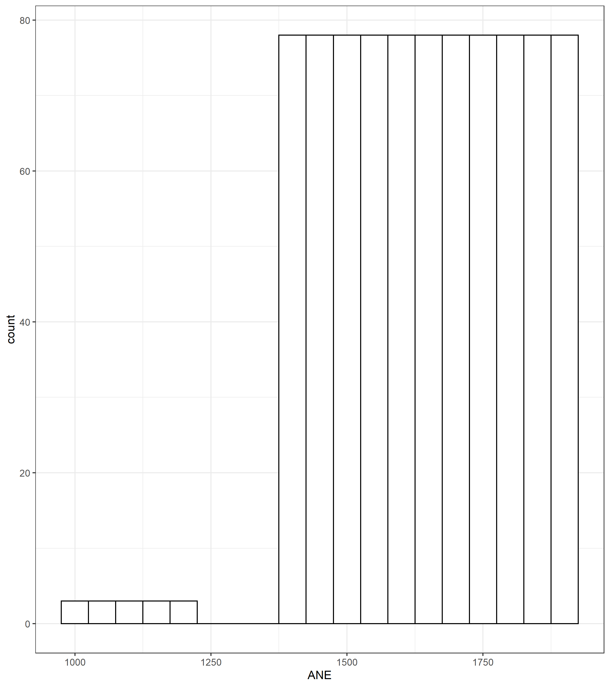
</p>

## EDTF

Performs an aoristic analysis. By default, the function reads the sample data `disturbances_edtf.xlsx` and performs the analysis by days (year-month-day: ``ymd``). Two graphs are created, one adding up all the threats, and the other where each category of threat is individualised.

Run the [`plot_edtf()`](https://eamena-project.github.io/eamenaR/doc/plot_edtf) function with the default parameters.

```
library(dplyr)

plot_edtf()
```

<p align="center">
  
</p>

Aggregate the dates by months (`"ym"`) by thearts categories.

```
plot_edtf(edtf_span = "ym", edtf_analyse = "category")
```

<p align="center">
  
</p>

The interactive plotly output is [edtf_plotly_category_ym_threats_types.html](https://eamena-project.github.io/eamenaR/results/edtf_plotly_category_ym_threats_types.html)

# General statistics

## Users

The function [`ref_db()`](https://eamena-project.github.io/eamenaR/doc/ref_db) provides basic statistics on the users of the EAMENA database, for example by plotting the cumulative distribution function of the user first registration:

```
d <- hash::hash()
my_con <- RPostgres::dbConnect(drv = RPostgres::Postgres(),
                               user = 'xxx',
                               password = 'xxx',
                               dbname = 'eamena',
                               host = 'ec2-54-155-109-226.eu-west-1.compute.amazonaws.com',
                               port = 5432)
d <- ref_db(db.con = my_con,
            d = d,
            date.after = "2020-08-01",
            plot.g = T,
            fig.width = 14)
```

Here we restrict the plot to dates after 2020-08-01 (option `date.after`). The option `plot.g = T` gives this plot:

<p align="center">
  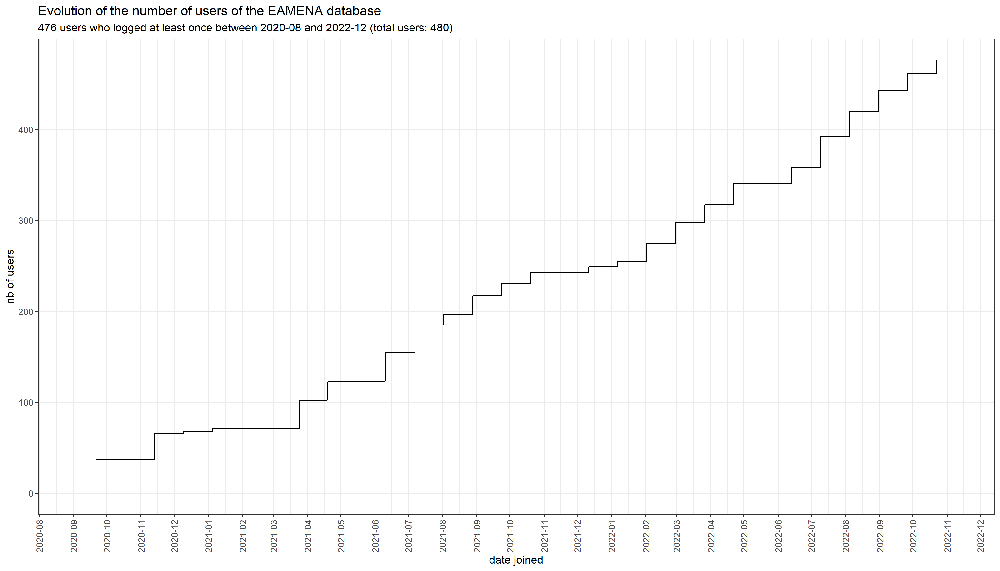
</p>

The total number of users can also be restricted to an interval (options `date.after` and `date.before`), for example limiting the count to the year 2022: 

```
d <- ref_db(db.con = my_con,
               stat.name = "users_date_joined_2",
               d = d,
               date.after = "2022-01-01",
               date.before = "2022-12-01",
               plot.g = T,
               export.plot.g = T,
               fig.width = 14)

```

<p align="center">
  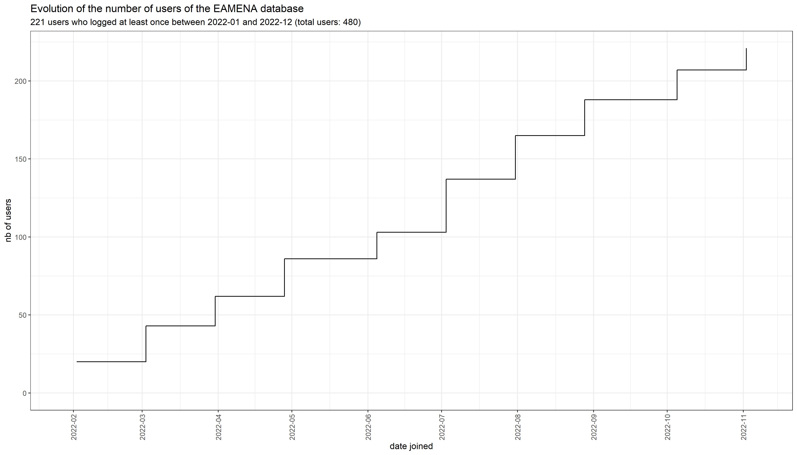
</p>


```
d$total_users
#   count
# 1   480
```

The other statistic calculated is the total number of users (minus those who have an account but have never logged in)


# Data management

## Duplicates

The function [`ref_are_duplicates()`](https://eamena-project.github.io/eamenaR/doc/ref_are_duplicates) identifies potential duplicates in a GeoJSON file, or directly in the EAMENA database. Using a fuzzy match between the values of a selection of fields, for two HPs identified by their ResourceID, this function creates a data frame with the match score (`dist` column) between each field:

```
d <- hash::hash()
d <- ref_are_duplicates(d = d,
                        export.table = T,
                        fileOut = "duplicates.csv")
```

Creates this kind of table:
  
| field                           | 563567f7-eef0-4683-9e88-5e4be2452f80 | fb0a2ef4-023f-4d13-b931-132799bb7a6c | dist |
|---------------------------------|--------------------------------------|--------------------------------------|------|
| EAMENA ID                       | EAMENA-0207209                       | EAMENA-0182057                       |  -   |
| Assessment.Investigator...Actor | Hamed Rahnama                        | Hamed Rahnama, Bijan Rouhani         | 0.18 |
| Assessment.Activity.Date        | 2021-05-25                           | 2022-08-21, 2022-08-30               | 0.32 |
| Resource.Name                   | Bedasht Caravanserai, ..., CVNS-IR   | CVNS-IR, Bedasht Caravanserai, ...   | 0.26 |
| geometry                        | c(55.05059, 36.42466)                | c(55.05059, 36.42466)                | 0    |

The `dist` shows that the geometries are exactly the same, and that there are slight differences in the other fields. The CSV output is here: https://github.com/eamena-project/eamenaR/blob/main/results/duplicates.csv

## BU

The Bulk upload procedure
### BU mapping

Get a BU file (*target*, see ["what is a BU?"](https://github.com/eamena-project/eamena-arches-dev/tree/main/data/bulk#bulk-upload-bu--)) from an already structured file (*source*) with the [list_mapping_bu()](https://eamena-project.github.io/eamenaR/doc/list_mapping_bu) function. This function uses a mapping file to create the equivalences between the source file and the target file

```mermaid
flowchart LR
    A[structured file<br><em>source</em>] ----> B("list_mapping_bu()"):::eamenaRfunction;
    A -. a. get MBR .-> D("geom_bbox()"):::eamenaRfunction;
    B --1. mapping file--> B;
    B --2. export--> C[BU file<br><em>target</em>];
    subgraph ide1 [Geometries];
    D -. b. creates .-> E[mbr.geojson];
    end;
    E -. + GRID ID .-> B; 
    classDef eamenaRfunction fill:#e7deca;
```

functions: 
  - [list_mapping_bu()](https://eamena-project.github.io/eamenaR/doc/list_mapping_bu)  
  - [geom_bbox()](https://eamena-project.github.io/eamenaR/doc/geom_bbox)  

For example, the dataset prepared by Mohamed Kenawi (`mk`):

```
library(dplyr)

ggsheet <- 'https://docs.google.com/spreadsheets/d/1nXgz98mGOySgc0Q2zIeT1RvHGNl4WRq1Fp9m5qB8g8k/edit#gid=1083097625'
list_mapping_bu(bu.path = "C:/Rprojects/eamena-arches-dev/data/bulk/bu/",
                job = "mk",
                verb = T,
                mapping.file = ggsheet,
                mapping.file.ggsheet = T)
```

#### Mapping file

To establish the correspondences between a structured file (the source) and the structure of the EAMENA BU template (the target), the [list_mapping_bu()](https://eamena-project.github.io/eamenaR/doc/list_mapping_bu) function uses a mapping file (ie, a correspondance table). This mapping file could be either an XLSX file or a Google Sheet. 

<p align="center">
  
  <br>
    <em>screenshot of the Google sheet mapping file: https://docs.google.com/spreadsheets/d/1nXgz98mGOySgc0Q2zIeT1RvHGNl4WRq1Fp9m5qB8g8k/edit?usp=sharing</em>
</p>

For each 'job', the mapping file has three columns, one for the target ('`EAMENA`', always the same), two for the source (eg. '`mk`' and '`mk_type`', depending on the job):

1. ***target***, **by default `EAMENA`**:
  - '`EAMENA`': names of the fields in the EAMENA BU template spreadsheet in R format (spaces replaced by dots). Empty cells correspond to expressions that are not directly linked to an EAMENA field. This column will always be the same. 
2. **source**:
  - The source depends on the different authors:
    - `job`: by convention, the initial of the author (e.g. '`mk`' = Mohamed Kenawi)
    - `job_type`: the type of action to perform on the source data (e.g. '`mk_type`'). This can be: 
      - '`value`': repeat a single value for the whole BU;
      - '`field`': get the different values of a source field and add these different values in a BU field;
      - '`expression`': execute an R code snippet;
      - '`escape`': the value is calculated in another field;
      - etc.;

The [list_mapping_bu()](https://eamena-project.github.io/eamenaR/doc/list_mapping_bu) function uses the [`geom_within_gs()`](https://eamena-project.github.io/eamenaR/doc/geom_within_gs) to find the Grid square (gs) identifier of a record by comparing their geometries. By default, the Grid Square file is **grid_squares.geojson** ([rendered](https://github.com/eamena-project/eamenaR/blob/main/inst/extdata/grid_squares.geojson) | [raw](https://raw.githubusercontent.com/eamena-project/eamenaR/main/inst/extdata/grid_squares.geojson))

```
library(dplyr)

grid.id <- geom_within_gs(resource.wkt = "POINT(0.9 35.8)")
grid.id
```
Will return `"E00N35-44"`

#### Collect the grid squares

Each HP have to be associated with a grid square. If you want to retrieve the grid square ID *a posteriori*, after you fill the BU - or the BUs - an approriate way to do it is to run the [geom_bbox()](https://eamena-project.github.io/eamenaR/doc/geom_bbox) function. 

```
dataDir <- "C:/Users/Thomas Huet/Downloads/2022-12-08-20221208T154207Z-001/2022-12-08/"

geom_bbox(dataDir = dataDir,
          dirOut = dataDir,
          wkt_column = "Point")
```

This function retrieve the xmin, xmax, ymin, ymax (minimum bounding box, or MBR) of the HPs and creates as a **GeoJSON file**, by default: `mbr.geojson`, like this:

```
{
    "type": "FeatureCollection",
    "features": [
        {
            "type": "Feature",
            "properties": {
                "buffer": {
                    "width": "0",
                    "unit": "m"
                },
                "inverted": false
            },
            "geometry": {
                "type": "Polygon",
                "coordinates": [
                    [
                        [
                            1.69683243400041,
                            36.4166328242747
                        ],
                        [
                            8.05870602835295,
                            36.4166328242747
                        ],
                        [
                            8.05870602835295,
                            37.0812995946245
                        ],
                        [
                            1.69683243400041,
                            37.0812995946245
                        ],
                        [
                            1.69683243400041,
                            36.4166328242747
                        ]
                    ]
                ]
            }
        }
    ]
}
```

Copy/paste this `mbr.geojson` into the EAMENA DB map filter, to select and export the GeoJSON file of grid squares. In EAMENA DB, select `Filter` > `Map Search` >` Edit GeoJSON` and copy/paste the content of the new exported **GeoJSON file** into the EAMENA `Edit GeoJSON` field. Under the `Search` bar, filter by resources (`Resource Type`) and select `Grid Square`. Once the filters `Map Filtered Enabled` and `Grid Square` are on, only the needed Grid squares appear in the results. 

<p align="center">
  
  <br>
  <em>screenshot of the grid squares selection, export them as a new GeoJSON file </em>
</p>

Export these grid squares as a `geojson url`, paste this URL into a web browser, copy the content of the output into a new GeoJSON file[^5] and save this file. This last GeoJSON file will be used in the [`geom_within_gs()`](https://eamena-project.github.io/eamenaR/doc/geom_within_gs) function to retrieve the correct Grid square ID for each heritage place in the BU.

#### Source file

The source file, or original dataset, is assumed to be an XLSX file but it is possible to work with a SHP, or any other suitable format.

#### Target file

Export a new BU worksheet. 

<p align="center">
  
  <br>
  <em>screenshot of the output BU</em>
</p>

The data from this new worksheet can be copied/pasted into a [BU template](https://github.com/eamena-project/eamena-arches-dev/tree/main/data/bulk/templates) to retrieve the drop down menus and 3-lines headers. Once done, the BU can be sent to EAMENA.

<p align="center">
  
  <br>
  <em>screenshot of the output BU once copied/pasted into the template</em>
</p>


### BU append

#### Integrating Google Earth geometries

Most of the geometries in EAMENA are POINTS (`Geometry Type` = `Center Point`). The objective is to acquire new geometries, like POLYGONs, created in third part app, like Google Earth or a GIS, and to append them to already existing records in EAMENA.


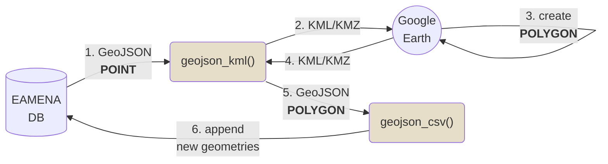
```mermaid
flowchart LR
    A[(EAMENA<br>DB)] --1. GeoJSON<br><b>POINT</b>--> C("geojson_kml()"):::eamenaRfunction;
    C --2. KML/KMZ--> B((Google<br>Earth));
    B --3. create<br><b>POLYGON</b>--> B;
    B --4. KML/KMZ--> C;
    C --5. GeoJSON<br><b>POLYGON</b>--> D("geojson_csv()"):::eamenaRfunction;
    D --6. append<br>new geometries--> A;
    classDef eamenaRfunction fill:#e7deca;
```

<p align="center"> workflow to work with Google Earth </p>

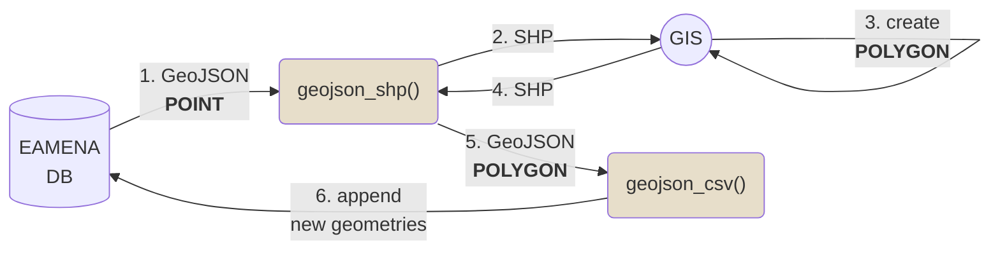
```mermaid
flowchart LR
    A[(EAMENA<br>DB)] --1. GeoJSON<br><b>POINT</b>--> E("geojson_shp()"):::eamenaRfunction;
    E --2. SHP--> F((GIS));
    F --3. create<br><b>POLYGON</b>--> F;
    F --4. SHP--> E;
    E --5. GeoJSON<br><b>POLYGON</b>--> D("geojson_csv()"):::eamenaRfunction;
    D --6. append<br>new geometries--> A;
    classDef eamenaRfunction fill:#e7deca;
```

<p align="center"> workflow to work with a GIS </p>
  
  
functions: 
  - [`geojson_kml()`](https://eamena-project.github.io/eamenaR/doc/geojson_kml) 
  - [`geojson_shp()`](https://eamena-project.github.io/eamenaR/doc/geojson_shp)  
  - [`geojson_csv()`](https://eamena-project.github.io/eamenaR/doc/geojson_csv)  

For example:

1. Export a GeoJSON file from EAMENA (see: [GeoJSON files](https://github.com/eamena-project/eamenaR#geojson-files)), for example **caravanserail.geojson** ([rendered](https://github.com/eamena-project/eamena-arches-dev/blob/main/data/geojson/caravanserail.geojson) | [raw](https://raw.githubusercontent.com/eamena-project/eamena-arches-dev/main/data/geojson/caravanserail.geojson)) Heritage Places.  

<a name="geojson_kml"></a>  

2. Convert **caravanserail.geojson** to a KML file named 'caravanserail_outKML.kml' with the [`geojson_kml()`](https://eamena-project.github.io/eamenaR/doc/geojson_kml) function, filtering on POINTS[^3]:

```
library(dplyr)
geojson_kml(geom.types = c("POINT"),
            geojson.name = "caravanserail_outKML")
```


<a name="bulk_append_3"></a>

3. Open 'caravanserail_outKML' in Google Earth and draw POLYGONS. Name the newly created POLYGONS with the ResourceID of a given HP.

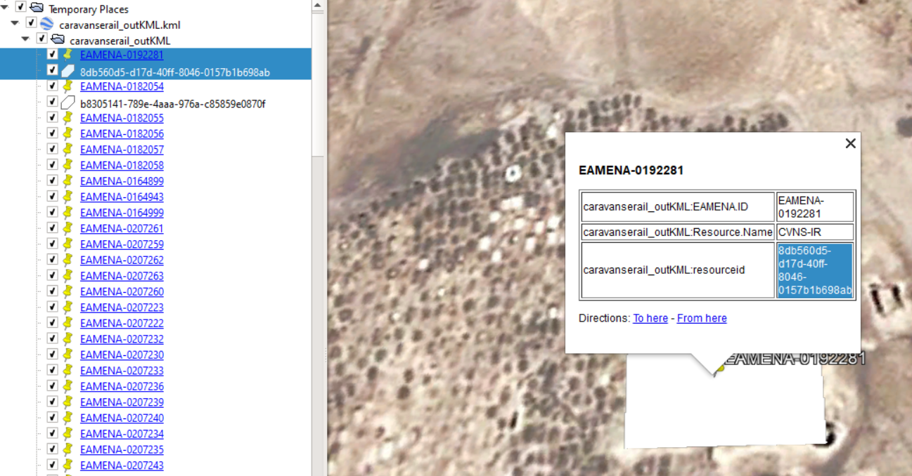

4. Export as KML ('caravanserail_outKML2.kml')
5. Convert 'caravanserail_outKML2.kml' into GeoJSON with the [`geojson_kml()`](https://eamena-project.github.io/eamenaR/doc/geojson_kml) function selecting only the POLYGONs (ie, the new geometries).

```
geojson_kml(geom.path = geom.path = paste0(system.file(package = "eamenaR"),
                                           "/extdata/caravanserail_outKML2.kml")
            geom.types = c("POLYGON"),
            geojson.name = "caravanserail_outGeoJSON")
```

The result is new POLYGON geometries (eg. [caravanserail_outGeoJSON.geojson](https://raw.githubusercontent.com/eamena-project/eamenaR/main/results/caravanserail_outGeoJSON.geojson))


6. Convert the GeoJSON POLYGONs geometries to a format compliant with the EAMENA DB, using the [`geojson_csv()`](https://eamena-project.github.io/eamenaR/doc/geojson_csv) function

```
geojson_csv(geom.path = paste0(system.file(package = "eamenaR"),
                               "/extdata/caravanserail_outGeoJSON.geojson"),
            csv.name = "caravanserail_outCSV")
```

The result is a CSV file, [caravanserail_outCSV.csv](https://github.com/eamena-project/eamenaR/blob/main/inst/extdata/caravanserail_outCSV.csv), with the ResourceID and the geometry of each HP. The fields "Location Certainty" and "Geometry Extent Certainty" are filled with default values.

<a name="bulk_append_6"></a>
```
"resourceid","Geometric Place Expression","Location Certainty","Geometry Extent Certainty"
"8db560d5-d17d-40ff-8046-0157b1b698ab","MULTIPOLYGON (((61.4023 30.77373, 61.4019 30.77371, 61.40194 30.77344, 61.40235 30.77345, 61.4023 30.77373)))","High","High"
"b8305141-789e-4aaa-976a-c85859e0870f","MULTIPOLYGON (((51.47507 33.09169, 51.47463 33.09125, 51.47519 33.09086, 51.47561 33.09133, 51.47507 33.09169)))","High","High"
```

7. These new geometries will be uploaded into the EAMENA DB and append to existing HP. But it should be safe to first check that every ResourceID exist in the DB (maybe a newly created POLYGON has a typo in its name). Use the [`uuid_id()`](https://eamena-project.github.io/eamenaR/doc/uuid_id) function, in a loop to confirm the existence of the ResourceID

```
mycsv <- "https://raw.githubusercontent.com/eamena-project/eamenaR/main/inst/extdata/caravanserail_outCSV.csv"
df <- read.csv(mycsv)
for(i in seq(1, nrow(df))){
  eamenaid <- df[i, "ResourceID"]
  d <- uuid_id(db.con = my_con,
                     d = d,
                     id = eamenaid,
                     disconn = FALSE)
  print(paste0(as.character(i), ") ", eamenaid, " <-> ", d$eamenaid))
}
DBI::dbDisconnect(my_con)
```

Will give:

```
[1] "1) 8db560d5-d17d-40ff-8046-0157b1b698ab <-> EAMENA-0192281"
[1] "2) b8305141-789e-4aaa-976a-c85859e0870f <-> EAMENA-0182054"
```

As there are no `NA` in front of the ResourceID, the HP listed in the CSV file exist in the DB.

8. To append these geometries to the DB, use the `-ow append` option in the `import_business_data` function (see the [Arches documentation](https://arches.readthedocs.io/en/5.1/command-line-reference/#import-business-data))

<a name="bu_append_8"></a>
```
python manage.py packages -o import_business_data -s "./data/test/caravanserail_outCSV2.csv" -c "./data/test/Heritage Place.mapping" -ow append
```

Now, each of these two HP has two different kind of geometries: POINT and POLYGON. See for example the whole dataset of caravanserails
[caravanserail_polygon.geojson](https://github.com/eamena-project/eamenaR/blob/main/inst/extdata/caravanserail_polygon.geojson), one of the record rendered ([EAMENA-0192281.geojson](https://github.com/eamena-project/eamenaR/blob/main/inst/extdata/EAMENA-0192281.geojson)) or this latter record in the [EAMENA DB](https://database.eamena.org/en/report/8db560d5-d17d-40ff-8046-0157b1b698ab)[^4]. 


# Others

## Share a GeoJSON geometry

Go to https://geojson.io/, use the geocoder to find a location, draw a POINT, LINE or a POLYGON (in green), copy the JSON geometry (in red) and paste it into a new `.geojson` file.  


The format of a rectangle selection is 4 different points[^2], starting from the geographical origin (`xmin, ymin`), e.g.: `"POINT(0 0)"`

```
[
    xmin,
    ymin
],
[
    xmax,
    ymin
],
[
    xmax,
    ymax
],
[
    xmin
    ymax
],
[
    xmin,
    ymin
]
```

[^1]: JavaScript is **THE** interactive web language, and the most popular file types are JSON and GeoJSON (respectively JavaScript Objet Notation and GeoJavaScript Object Notation).
[^2]: there is a duplicate which comes from the need to close the polygon, so the coordinates of the origin (`xmin, ymin`) are the same as those of the last point.
[^3]: Sometimes, a search in EAMENA returns different types of geometries. This is the case for the caravanserails where geometries can be both POINTs and POLYGONs.
[^4]: EAMENA-0192281 ResourceID = `8db560d5-d17d-40ff-8046-0157b1b698ab` 
[^5]: You can 'beautify' it using https://codebeautify.org/jsonviewer
[^6]: Plotly: https://plotly.com
[^7]: Leaflet: https://leafletjs.com/
[^8]: Arches: https://www.archesproject.org/
[^9]: https://github.com/eamena-project/eamenaR/blob/main/.github/CONTRIBUTING.md
