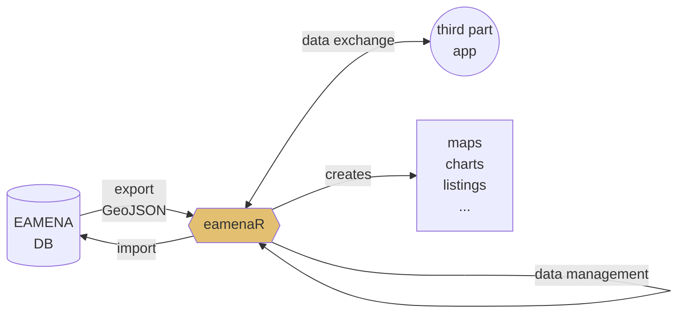
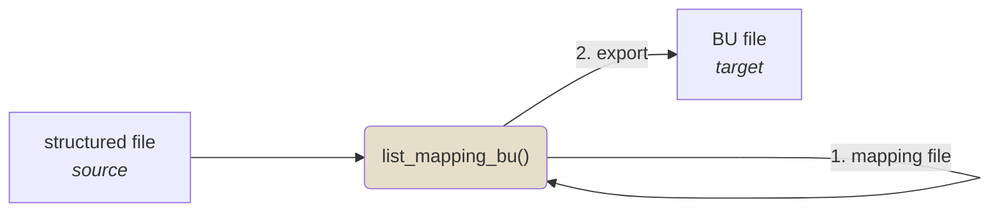

# ***eamenaR*** 
> R package for front-end statistical analysis of the EAMENA database

The ***eamenaR*** package allows to analyse the [typological](https://github.com/eamena-oxford/eamenaR#typology), [spatial](https://github.com/eamena-oxford/eamenaR#time) and [temporal](https://github.com/eamena-oxford/eamenaR#time) data of the [EAMENA database](https://database.eamena.org/en/).  
  
The two main sources of data are: 
* GeoJSON files exported by [EAMEANA searches](https://github.com/eamena-oxford/eamena-arches-dev/tree/main/data/geojson#readme); 
* data exported *via* a direct connection to the EAMENA PostgreSQL database (restricted access); 

The two main types of output are:
* static graphs and maps, for publication on paper;
* interactive graphs and maps for publication on the web (with Plotly and Leaflet);

Together with analysis functions, the package offers different methods to manage inputs and outputs from/to EAMENA.


   
The functions names refer to their content :

| Function prefix      | Description                                            | Example                  |
| -----------          | -----------                                            |------                    |
| geojson_*            | all functions that deal with GeoJSON                   | `geojson_map()`          |
| geom_*               | any other function that deals with geometries          | `geom_bbox()`            |
| list_*               | structure a dataset                                    | `list_mapping_bu()`      |
| plot_*               | creates a map, a graphic, etc.                         | `plot_edtf()`            |
| ref_*                | direct connection to the EAMENA PostgreSQL database    | `ref_cultural_periods()` |

# Install and load package

Install the R package

```
devtools::install_github("eamena-oxford/eamenaR")
```

And load the package

```
library(eamenaR)
```

---

**How it works ?**  

The root directory on your local computer will be (*run*): `system.file(package = "eamenaR")`. By default, output will be saved in the `results/` folder. You can change this output folder by changing the `dirOut` option in the various functions to your choice. The `inst/extdata/` folder collects different sample files (GeoJSON, KML/KMZ, XLSX, etc.). 

---

# Data

GeoJSON is the privilegied format to work with EAMENA. Create a search in EAMENA, in the export menu, copy the **geojson url** (in green) to the clipboard, paste it into your web browser and create a GeoJSON file[^1].


Paste the copied URL into your web browser and create a GeoJSON file, the result is something like :


You can reformat the (Geo)JSON layout to make it more readable using https://codebeautify.org/jsonviewer. Copy the text content and save it in a new GeoJSON file, for example **caravanserail.geojson** Heritage Places ([rendered](https://github.com/eamena-oxford/eamena-arches-dev/blob/main/data/geojson/caravanserail.geojson) | [raw](https://raw.githubusercontent.com/eamena-oxford/eamena-arches-dev/main/data/geojson/caravanserail.geojson))

## Duplicates

The function [`ref_are_duplicates()`](https://eamena-oxford.github.io/eamenaR/doc/ref_are_duplicates) identifies potential duplicates in a GeoJSON file, or directly in the EAMENA database. Using a fuzzy match between the values of a selection of fields, for two HPs identified by their ResourceID, this function creates a data frame with the match score (`dist` column) between each field:

```
d <- hash::hash()
d <- ref_are_duplicates(d = d,
                        export.table = T,
                        fileOut = "duplicates.csv")
```

Creates this kind of table:

| field                           | 563567f7-eef0-4683-9e88-5e4be2452f80 | fb0a2ef4-023f-4d13-b931-132799bb7a6c | dist |
|---------------------------------|--------------------------------------|--------------------------------------|------|
| Assessment.Investigator...Actor | Hamed Rahnama                        | Hamed Rahnama, Bijan Rouhani         | 0.18 |
| Assessment.Activity.Date        | 2021-05-25                           | 2022-08-21, 2022-08-30               | 0.32 |
| Resource.Name                   | Bedasht Caravanserai, ..., CVNS-IR   | CVNS-IR, Bedasht Caravanserai, ...   | 0.26 |
| geometry                        | c(55.05059, 36.42466)                | c(55.05059, 36.42466)                | 0    |

Where `563567f7-eef0-4683-9e88-5e4be2452f80` and `fb0a2ef4-023f-4d13-b931-132799bb7a6c` are the default ResourceIDs of the function (respectively the two caravanserais `EAMENA-0207209` and `EAMENA-0182057`). The `dist` shows that the geometries are exactly the same, and that there are slight differences in the other fields. The CSV output is here: https://github.com/eamena-oxford/eamenaR/blob/main/results/duplicates.csv

## Share a GeoJSON geometry

Go to https://geojson.io/, use the geocoder to find a location, draw a POINT, LINE or a POLYGON (in green), copy the JSON geometry (in red) and paste it into a new `.geojson` file.  


The format of a rectangle selection is 4 different points[^2], starting from the geographical origin (`xmin, ymin`), e.g.: `"POINT(0 0)"`

```
[
    xmin,
    ymin
],
[
    xmax,
    ymin
],
[
    xmax,
    ymax
],
[
    xmin
    ymax
],
[
    xmin,
    ymin
]
```

### Integrating Google Earth geometries

Most of the geometries in EAMENA are POINTS (Center Point). The objective is to acquire new geometries created in Google Earth and to add them to already existing records in EAMENA.


  
functions: 
  - [`geojson_kml()`](https://eamena-oxford.github.io/eamenaR/doc/geojson_kml)   
  - [`geojson_csv()`](https://eamena-oxford.github.io/eamenaR/doc/geojson_csv)  

For example:

1. Export a GeoJSON file from EAMENA (see: [GeoJSON files](https://github.com/eamena-oxford/eamenaR#geojson-files)), for example **caravanserail.geojson** Heritage Places.  

<a name="geojson_kml"></a>  

2. Convert **caravanserail.geojson** to a KML file named 'caravanserail_outKML' with the [`geojson_kml()`](https://eamena-oxford.github.io/eamenaR/doc/geojson_kml) function, filtering on POINTS[^3]:

```
library(dplyr)
geojson_kml(geom.types = c("POINT"),
            geojson.name = "caravanserail_outKML")
```


3. Open 'caravanserail_outKML' in Google Earth and draw POLYGONS. Name the new POLYGONS with the ResourceID of a given HP.


4. Export as KML ('caravanserail_outKML2.kml')
5. Convert 'caravanserail_outKML2.kml' into GeoJSON with the [`geojson_kml()`](https://eamena-oxford.github.io/eamenaR/doc/geojson_kml) function selecting only the POLYGONs (ie, the new geometries).

```
geojson_kml(geom.path = geom.path = paste0(system.file(package = "eamenaR"),
                                           "/extdata/caravanserail_outKML2.kml")
            geom.types = c("POLYGON"),
            geojson.name = "caravanserail_outGeoJSON")
```

The result is new POLYGON geometries (eg. [caravanserail_outGeoJSON.geojson](https://raw.githubusercontent.com/eamena-oxford/eamenaR/main/results/caravanserail_outGeoJSON.geojson))


6. Convert the GeoJSON POLYGONs geometries to a format compliant with the EAMENA DB, using the [`geojson_csv()`](https://eamena-oxford.github.io/eamenaR/doc/geojson_csv) function

```
geojson_csv(geom.path = paste0(system.file(package = "eamenaR"),
                               "/extdata/caravanserail_outGeoJSON.geojson"),
            csv.name = "caravanserail_outCSV")
```

The result is a CSV file, [caravanserail_outCSV.csv](https://github.com/eamena-oxford/eamenaR/blob/main/inst/extdata/caravanserail_outCSV.csv), with the ResourceID and the geometry of each HP. The fields "Location Certainty" and "Geometry Extent Certainty" are filled with default values.

```
"resourceid","Geometric Place Expression","Location Certainty","Geometry Extent Certainty"
"8db560d5-d17d-40ff-8046-0157b1b698ab","MULTIPOLYGON (((61.4023 30.77373, 61.4019 30.77371, 61.40194 30.77344, 61.40235 30.77345, 61.4023 30.77373)))","High","High"
"b8305141-789e-4aaa-976a-c85859e0870f","MULTIPOLYGON (((51.47507 33.09169, 51.47463 33.09125, 51.47519 33.09086, 51.47561 33.09133, 51.47507 33.09169)))","High","High"
```

These new geometries can be uploaded into EAMENA using the `-ow append` argument in the `import_business_data` function (see the [Arches documentation](https://arches.readthedocs.io/en/5.1/command-line-reference/#import-business-data))

<a name="bu_append"></a>
```
python manage.py packages -o import_business_data -s "./data/test/caravanserail_outCSV2.csv" -c "./data/test/Heritage Place.mapping" -ow append
```

Now, each of these two HP has two different kind of geometries: POINT and POLYGON. See for example the [geojson file](https://github.com/eamena-oxford/eamenaR/blob/main/inst/extdata/EAMENA-0192281.geojson) or the [EAMENA record](https://database.eamena.org/en/report/8db560d5-d17d-40ff-8046-0157b1b698ab) of EAMENA-0192281[^4]. 

## BU mapping

Get a BU file (target file, see ["what is a BU?"](https://github.com/eamena-oxford/eamena-arches-dev/tree/main/data/bulk#bulk-upload-bu--)) from an already structured file (source file) with the [`list_mapping_bu()`](https://eamena-oxford.github.io/eamenaR/doc/list_mapping_bu) function. This function uses a mapping file to create the equivalences between the source file and the target file



function: 
  - [`list_mapping_bu()`](https://eamena-oxford.github.io/eamenaR/doc/list_mapping_bu)  

For example, the dataset prepared by Mohamed Kenawi (`mk`):

```
library(dplyr)

ggsheet <- 'https://docs.google.com/spreadsheets/d/1nXgz98mGOySgc0Q2zIeT1RvHGNl4WRq1Fp9m5qB8g8k/edit#gid=1083097625'
list_mapping_bu(bu.path = "C:/Rprojects/eamena-arches-dev/data/bulk/bu/",
                job = "mk",
                verb = T,
                mapping.file = ggsheet,
                mapping.file.ggsheet = T)
```

### Mapping file

The mapping file could be either an XLSX file or a Google Sheet. This file establishes the correspondences between a source file and the structure of the EAMENA BU template (target). 


<p align="center">
  
  <br>
    <em>screenshot of the Google sheet mapping file: https://docs.google.com/spreadsheets/d/1nXgz98mGOySgc0Q2zIeT1RvHGNl4WRq1Fp9m5qB8g8k/edit?usp=sharing</em>
</p>

The mapping file has three columns, one for the target ('`EAMENA`'), two for the source (eg. '`mk`' and '`mk_type`'):

1. **target**:
  - '`EAMENA`': names of the fields in the EAMENA BU spreadsheet in R format (spaces replaced by dots). Empty cells correspond to expressions that are not directly linked to an EAMENA field. This column will always be the same. 
2. **source**:
  - The source depends on the different authors:
    - `job`: by convention, the initial of the author (e.g. '`mk`' = Mohamed Kenawi)
    - `job_type`: the type of action to perform on the source data (e.g. '`mk_type`'). This can be: 
      - '`value`': repeat a single value for the whole BU;
      - '`field`': get the different values of a source field and add these different values in a BU field;
      - '`expression`': execute an R code snippet;
      - etc.;

The eamenaR function is [`list_mapping_bu()`](https://eamena-oxford.github.io/eamenaR/doc/list_mapping_bu). Alongside with scripted parts recorded in the mapping file, `list_mapping_bu()` uses also the [`geom_within_gs()`](https://eamena-oxford.github.io/eamenaR/doc/geom_within_gs) to find the Grid square (gs) identifier of a record by comparing their geometries[^5]. By default, the Grid Square file is **grid_squares.geojson** ([rendered](https://github.com/eamena-oxford/eamenaR/blob/main/inst/extdata/grid_squares.geojson) | [raw](https://raw.githubusercontent.com/eamena-oxford/eamenaR/main/inst/extdata/grid_squares.geojson))

```
library(dplyr)

grid.id <- geom_within_gs(resource.wkt = "POINT(0.9 35.8)")
grid.id
```
Will return `"E00N35-44"`

### Source file

The source file, or original dataset, is assumed to be an XLSX file but it is possible to work with a SHP, or any other suitable format.

### Target file

Export a new BU worksheet. 

<p align="center">
  
  <br>
  <em>screenshot of the output BU</em>
</p>

The data from this new worksheet can be copied/pasted into a [BU template](https://github.com/eamena-oxford/eamena-arches-dev/tree/main/data/bulk/templates) to retrieve the drop down menus and 3-lines headers. Once done, the BU can be sent to EAMENA.

<p align="center">
  
  <br>
  <em>screenshot of the output BU once copied/pasted into the template</em>
</p>

# Typology

Whether the data is Heritage Places, Built Components, etc.

# Spatial

Distribution maps for Heritages places and Geoarchaeology

## Heritages places

For the default GeoJSON file **caravanserail.geojson** Heritage Places ([rendered](https://github.com/eamena-oxford/eamena-arches-dev/blob/main/data/geojson/caravanserail.geojson) | [raw](https://raw.githubusercontent.com/eamena-oxford/eamena-arches-dev/main/data/geojson/caravanserail.geojson))

```
geojson_map(map.name = "caravanserail", fig.width = 11, export.plot = T)
```

<p align="center">
  
</p>

Maps can also be calculated on the values of GeoJSON fields, by adding the field names in the [`geojson_map()`](https://eamena-oxford.github.io/eamenaR/doc/geojson_map) function options.

```
geojson_map(map.name = "caravanserail",
            field.names = c("Damage Extent Type"),
            fig.width = 11,
            export.plot = T)
```

<p align="center">
  
</p>

The color of the value (optional) is recorded in the (`symbology.xlsx`)[https://github.com/eamena-oxford/eamenaR/blob/main/inst/extdata/symbology.xlsx] file  

<p align="center">
  
  <br>
    <em>screenshot of the `symbology.xlsx` file registering the different colors of the values (only the columns `list`, `values` and `colors` are used)</em>
</p>

```
geojson_map(map.name = "caravanserail",
            field.names = c("Disturbance Cause Type ", "Damage Extent Type"),
            fig.width = 11,
            export.plot = T)
```

It will create two series of maps, one for each field (`"Disturbance Cause Type ", "Damage Extent Type"`) and because in `"Damage Extent Type"` there are multiple values for a same row, it creates as many maps as there are different values, here is an example:

<p align="center">
  
  
</p>

### Heritages places IDs ➡️ EAMENA ID 

Retrieve the matches between these maps' IDs and the EAMENA IDs for heritage places by running the [`geojson_stat()`](https://eamena-oxford.github.io/eamenaR/doc/geojson_stat) function:

```
geojson_stat(stat.name = "caravanserail", stat = "list_ids", export.stat = T)
```

This will give the data frame [caravanserail_list_ids.tsv](https://github.com/eamena-oxford/eamenaR/blob/main/results/caravanserail_list_ids.tsv). If you want the maps' IDs listed (e.g. for a figure caption), run :

```
geojson_stat(stat.name = "caravanserail", stat = "list_ids", export.stat = F)
```

Will give:

```
1: EAMENA-0192223, 2: EAMENA-0192598, 3: EAMENA-0192599, [...], 153: EAMENA-0194775, 154: EAMENA-0194776, 155: EAMENA-0194777, 156: EAMENA-0194778
```
### Paths

Reading the GeoJSON file of the heritage places, and [the CSV file](https://github.com/eamena-oxford/eamenaR/blob/main/inst/extdata/caravanserail_paths.csv) registering the paths between these heritage places, identified by different routes (route 1, route 2, etc.). Map them using the [`geojson_map_path()`](https://eamena-oxford.github.io/eamenaR/doc/geojson_map_path) function

```
geojson_map_path(map.name = "caravanserail_paths", export.plot = T, fig.width = 11)
```

<p align="center">
  
</p>

Path lengths can be visualized in a boxplot, by routes

```
geojson_boxplot_path(export.plot = T)
```

<p align="center">
  
</p>


### Measurements

Plot some measurements, here the areas, both for the whole heritage places (left) or for the heritages places discrimined by routes (right) with the [`geojson_measurements()`](https://eamena-oxford.github.io/eamenaR/doc/geojson_measurements) function:

```
require(gridExtra)
p1 <- geojson_measurements(stat.name = "areas")
p2 <- geojson_measurements(stat.name = "areas_by_routes", by.routes = T)

grid.arrange(p1, p2, ncol = 2, widths = c(1, 2))
```

<p align="center">
  
</p>


## Geoarchaeology

For MaREA geoarchaeological data, with the [`geojson_map()`](https://eamena-oxford.github.io/eamenaR/doc/geojson_map) function:

```
geojson_map(map.name = "geoarch",
            ids = "GEOARCH.ID",
            stamen.zoom = 6,
            geojson.path = "C:/Rprojects/eamena-arches-dev/data/geojson/geoarchaeo.geojson",
            export.plot = F)
```

<p align="center">
  
</p>

# Time

Either for [cultural periods](https://github.com/eamena-oxford/eamenaR#cultural-periods) or [EDTF](https://github.com/eamena-oxford/eamenaR#edtf) formats

## Cultural Periods

### Cultural and Subcultural periods references

Use the [`ref_cultural_periods()`](https://eamena-oxford.github.io/eamenaR/doc/ref_cultural_periods) and [`list_child_concepts()`](https://eamena-oxford.github.io/eamenaR/doc/list_child_concepts) to retrieve the list of cultural periods and subperiods directly from the EAMENA DB. 

```
# create an hash dictionnary to store the cultural ans subcultural periods
d <- hash::hash()
# replace 'xxx' with the username and password
my_con <- RPostgres::dbConnect(drv = RPostgres::Postgres(),
                               user = 'xxx',
                               password = 'xxx',
                               dbname = 'eamena',
                               host = 'ec2-54-155-109-226.eu-west-1.compute.amazonaws.com',
                               port = 5432)
# get cultural periods and subcultural periods
d <- list_child_concepts(db.con = my_con, d = d, 
                         field = "cultural_periods", 
                         uuid = '3b5c9ac7-5615-3de6-9e2d-4cd7ef7460e4')
d <- ref_cultural_periods(db.con = my_con, d = d,
                          field = "cultural_periods")
d <- list_child_concepts(db.con = my_con, d = d, 
                         field = "subcultural_periods", 
                         uuid = '16cb160e-7b31-4872-b2ca-6305ad311011')
d <- ref_cultural_periods(db.con = my_con, d = d,
                          field = "subcultural_periods")
# export as TSV
df.periods <- rbind(d$cultural_periods, d$subcultural_periods)
tout <- paste0("C:/Rprojects/eamenaR/results/cultural_periods.tsv")
write.table(df.periods, tout, sep ="\t", row.names = F)
# disconnect from the DB
RPostgres::dbDisconnect(my_con)
```

Gives [this TSV dataframe](https://github.com/eamena-oxford/eamenaR/blob/main/results/cultural_periods.tsv) with (sub)cultural periods names, *tpq* and *taq*

<p align="center">
  
    <br>
  <em>screenshot of the</em> `cultural_periods.tsv` <em>dataframe</em>
</p>

---
  
**How it works ?**

These two functions connects the EAMENA DB to parse the arborescence of periods (parents) and superiods (childs) concepts (a tree-like structure) to retrieve their names, their start date (*tpq*) and end date (*taq*).

<p align="center">
  
  <br>
  <em>screenshot of the Reference Data Manager, parent node Cultural Period</em>
</p>

These latters (start date and end date) are stored in the `scopeNote` of each cultural periods and subperiods

<p align="center">
  
  <br>
  <em>screenshot of the Reference Data Manager, child node Palaeolithic (Levant/Mesopotamia/Arabia)</em>
</p>
  
---

### Plot cultural periods from a GeoJSON file

Create a hash dictonnary named `d` to store all data

```
library(hash)

d <- hash()
```

Store all periods and sub-periods represented in the GeoJSON in the `d` dictonnary, and plot them by EAMENA ID using the [`list_cultural_periods()`](https://eamena-oxford.github.io/eamenaR/doc/list_cultural_periods) function

```
d <- list_cultural_periods(db = "geojson", 
                           d = d)
plot_cultural_periods(d = d, field = "periods", plot.type = "by.eamenaid", export.plot = T)
plot_cultural_periods(d = d, field = "subperiods", plot.type = "by.eamenaid", export.plot = T)
```
<p align="center">
  
<br><br>
and superiods
<br><br>
  
</p>

Here, the [`plot_cultural_periods()`](https://eamena-oxford.github.io/eamenaR/doc/plot_cultural_periods) function  will export two PNG charts for the default **caravanserail.geojson** file. Periods and subperiods represented in a GeoJSON file can also be summed in a histogram

```
plot_cultural_periods(d = d, field = "subperiods", plot.type = "histogram", export.plot = T)
```
<p align="center">
  
</p>

## EDTF

Performs an aoristic analysis. By default, the function reads the sample data `disturbances_edtf.xlsx` and performs the analysis by days (year-month-day: ``ymd``). Two graphs are created, one adding up all the threats, and the other where each category of threat is individualised.

Run the [`plot_edtf()`](https://eamena-oxford.github.io/eamenaR/doc/plot_edtf) function with the default parameters.

```
library(dplyr)

plot_edtf()
```

<p align="center">
  
</p>

Aggregate the dates by months (`"ym"`) by thearts categories.

```
plot_edtf(edtf_span = "ym", edtf_analyse = "category")
```

<p align="center">
  
</p>

The interactive plotly output is [edtf_plotly_category_ym_threats_types.html](https://eamena-oxford.github.io/eamenaR/results/edtf_plotly_category_ym_threats_types.html)

# Users

The function [`ref_users()`](https://eamena-oxford.github.io/eamenaR/doc/ref_users) provides basic statistics on the users of the EAMENA database, for example by plotting the cumulative distribution function of the user first registration:

```
d <- hash::hash()
my_con <- RPostgres::dbConnect(drv = RPostgres::Postgres(),
                               user = 'xxx',
                               password = 'xxx',
                               dbname = 'eamena',
                               host = 'ec2-54-155-109-226.eu-west-1.compute.amazonaws.com',
                               port = 5432)
d <- ref_users(db.con = my_con,
               d = d,
               date.after = "2020-08-01",
               plot.g = T,
               fig.width = 14)
```

The option `plot.g = T` gives this plot:

<p align="center">
  
</p>

Here we restrict the plot to dates after 2020-08-01 (option `date.after`). The other statistic calculated is the total number of users (minus those who have an account but have never logged in)

On 03/11/2022, the total number of users is **466**.

```
d$total_users
#   count
# 1   466
```

[^1]: JavaScript is **THE** interactive web language, and the most popular file types are JSON and GeoJSON (respectively JavaScript Objet Notation and GeoJavaScript Object Notation).
[^2]: there is a duplicate which comes from the need to close the polygon, so the coordinates of the origin (`xmin, ymin`) are the same as those of the last point.
[^3]: Sometimes, a search in EAMENA returns different types of geometries. This is the case for the caravanserails where geometries can be both POINTs and POLYGONs.
[^4]: EAMENA-0192281 ResourceID = `8db560d5-d17d-40ff-8046-0157b1b698ab`
[^5]: To recover the Grid cell ID for a given coordinates, use the [`geom_bbox()`](https://eamena-oxford.github.io/eamenaR/doc/geom_bbox) function on the BU file. This function retrieve the xmin, xmax, ymin, ymax (minimum bounding box) of the HPs and creates as a **GeoJSON file**. In EAMENA DB, select `Filter` > `Map Search` >` Edit GeoJSON` and copy/paste the content of the new exported **GeoJSON file** into the EAMENA `Edit GeoJSON` field. Under the `Search` bar, filter by resources (`Resource Type`) and select `Grid Square`. Once the filters `Map Filtered Enabled` and `Grid Square` are on, only the needed Grid squares appear in the results. Export these grid squares as a `geojson url`, paste this URL into a web browser, copy the content of the output into a new GeoJSON file and save this file. This last GeoJSON file will be used in the [`geom_within_gs()`](https://eamena-oxford.github.io/eamenaR/doc/geom_within_gs) function to retrieve the correct Grid square ID for each heritage place in the BU.